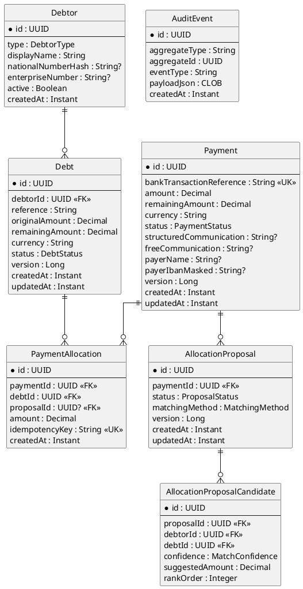
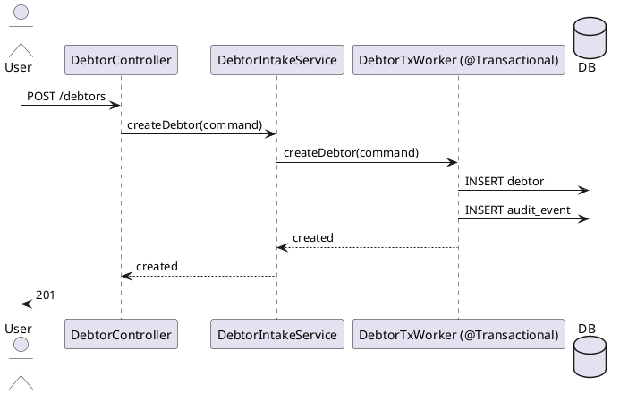
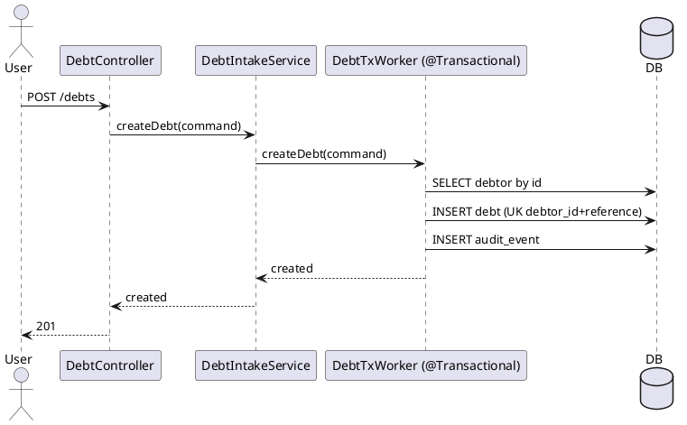
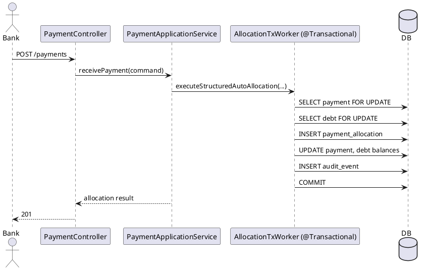

# Architecture Plan — Debtor/Debt Intake + Payment Allocation

**Trigger mode:** greenfield  
**SAD check:** no-sad (auto-downgraded; no SAD file found under `knowledge/`)  
**Date:** 2026-06-30  
**Author:** sad-architect-reviewer

> WARNING: produced without SAD validation.
> WARNING: review performed without SAD validation. Findings are best-effort against generic architecture standards.
> Recommendation: produce and maintain a SAD when budget allows.

## 1. Maven multi-module structure

```text
allocation/
├── pom.xml (aggregator)
├── domain/
├── application/
├── adapter-in/
├── adapter-out/
└── bootstrap/
```

Dependency flow (strict):
- `domain` -> no framework imports.
- `application` -> depends only on `domain`.
- `adapter-in` -> depends on `application` (+ `domain` types for mapping).
- `adapter-out` -> depends on `domain` (implements outbound ports, owns transactions).
- `bootstrap` -> wires all modules.

## 2. Data model (PlantUML entity diagram)



## 3. REST API endpoint table

| Method | Path | Request | Response | Status codes |
|---|---|---|---|---|
| POST | `/debtors` | CreateDebtorRequest | DebtorResponse | 201, 400, 409 |
| GET | `/debtors/{id}` | path id | DebtorResponse | 200, 404 |
| GET | `/debtors` | search/filter query | DebtorListResponse | 200 |
| POST | `/debts` | CreateDebtRequest | DebtResponse | 201, 400, 404, 409 |
| GET | `/debts/{id}` | path id | DebtResponse | 200, 404 |
| GET | `/debtors/{id}/debts` | path id + filters | DebtListResponse | 200, 404 |
| POST | `/payments` | ReceivePaymentRequest | PaymentResponse | 201, 400, 409 |
| GET | `/payments/{id}` | path id | PaymentDetailsResponse | 200, 404 |
| POST | `/payments/{id}/match` | path id | MatchResultResponse | 200, 202, 404, 409 |
| POST | `/payments/{id}/match/structured-communication` | path id | StructuredMatchResponse | 200, 202, 400, 404, 409 |
| POST | `/payments/{id}/match/identifier` | path id | ProposalCreationResponse | 200, 202, 400, 404 |
| POST | `/payments/{id}/match/name` | path id | ProposalCreationResponse | 200, 202, 400, 404 |
| GET | `/allocation-proposals/{id}` | path id | AllocationProposalResponse | 200, 404 |
| POST | `/allocation-proposals/{id}/validate` | ValidateProposalRequest | AllocationResultResponse | 200, 400, 404, 409 |
| POST | `/allocation-proposals/{id}/reject` | RejectProposalRequest | ProposalStateResponse | 200, 400, 404, 409 |
| POST | `/allocations` | ExecuteAllocationRequest | AllocationResultResponse | 201, 400, 404, 409 |
| GET | `/allocations/{id}` | path id | AllocationResponse | 200, 404 |

## 4. Locking strategy table

| Operation | Lock type | Implementation | Rationale |
|---|---|---|---|
| Debtor creation duplicate prevention | Unique constraints + optimistic | DB unique keys (`national_number_hash`, `enterprise_number`) + conflict mapping | Race-safe duplicate blocking without coarse lock |
| Debt creation duplicate prevention | Unique constraint + optimistic | DB unique key (`debtor_id`, `reference`) + conflict mapping | Prevent duplicate debt for same debtor under concurrency |
| Payment intake idempotency | Unique constraint + optimistic | Unique key on `bank_transaction_reference`, `@Version` on Payment | Retry-safe intake |
| Structured auto-allocation | Pessimistic write + optimistic recheck | `@Lock(PESSIMISTIC_WRITE)` on Payment/Debt in adapter-out transactional worker | Avoid double allocation and negative balances |
| Manual proposal validation allocation | Pessimistic write + optimistic | Lock Proposal + Payment + Debt rows in one transaction | Single winning validator and atomic balance updates |
| Proposal state transitions (reject/select/mark) | Optimistic | `@Version` on AllocationProposal | Prevent stale updates at lower lock cost |

Transaction boundary rule:
- `@Transactional` only in adapter-out workers; never in domain/application.

## 5. Sequence diagrams (PlantUML, main write flows with locking)

### 5.1 Debtor intake



### 5.2 Debt intake (with duplicate/exists checks)



### 5.3 Structured communication auto-allocation (locking)



## 6. Frontend page table

| Page name | File | Content |
|---|---|---|
| Debtor Intake | `bootstrap/src/main/resources/static/debtors/create.html` | Debtor create form, duplicate/error feedback, success card |
| Debtor Search/List | `bootstrap/src/main/resources/static/debtors/list.html` | Search debtor by name/identifier, pagination table |
| Debt Intake | `bootstrap/src/main/resources/static/debts/create.html` | Debt creation form linked to existing debtor |
| Debt Detail | `bootstrap/src/main/resources/static/debts/detail.html` | Debt summary, status, amounts, audit summary |
| Payment Intake | `bootstrap/src/main/resources/static/payments/intake.html` | Payment intake and matching trigger |
| Proposal Queue | `bootstrap/src/main/resources/static/proposals/list.html` | Manual validation queue and status chips |
| Allocation Validation | `bootstrap/src/main/resources/static/proposals/validate.html` | Candidate debts, validation reason, validate/reject actions |
| Allocation Detail | `bootstrap/src/main/resources/static/allocations/detail.html` | Allocation outcome and balance deltas |

Design alignment (PipelinePro): primary indigo actions, 4px spacing scale, card/list/chip patterns, masked sensitive identifiers by default.

## 7. Numbered implementation steps

| # | Step | Module | What | Test |
|---|---|---|---|---|
| 1 | Define domain aggregates and value objects (intake + allocation invariants) | domain | Debtor, Debt, Payment, Proposal, Allocation + guard clauses | JUnit5 domain tests per aggregate invariant |
| 2 | Define inbound/outbound ports | domain | Use-case ports and repository/gateway/worker ports | Compile + port contract tests with fakes |
| 3 | Implement persistence entities/repositories/mappers | adapter-out | JPA entities, Spring Data repos, MapStruct mappers, unique constraints, `@Version` | `@DataJpaTest` for mapping, constraints, optimistic locking |
| 4 | Implement transactional workers and lock orchestration | adapter-out | `@Transactional` workers for intake/allocation; pessimistic locks where needed | Concurrency tests for duplicate protection and no over-allocation |
| 5 | Implement application services | application | Orchestrate intake/matching/proposal/allocation via ports | JUnit5 + Mockito service tests |
| 6 | Implement REST controllers + DTO validation + mappers | adapter-in | Thin controllers for debtor/debt/payment/proposal/allocation endpoints | `@WebMvcTest` status/validation/contract tests |
| 7 | Implement exception handling and security boundary mapping | adapter-in | `@RestControllerAdvice`, error mapping, role checks at boundary | `@WebMvcTest` for error mapping + authorization scenarios |
| 8 | Implement bootstrap wiring and runtime config | bootstrap | Spring Boot app, bean wiring, module composition, H2 local config | Context load + smoke tests |
| 9 | Implement frontend pages | bootstrap | Static HTML/CSS/JS pages for intake, queue, validation, details | UI smoke tests + basic interaction tests |
| 10 | Hardening and end-to-end validation | bootstrap + adapter-out | End-to-end write-flow checks, idempotency, audit completeness | Focused integration tests per write flow |

Execution order follows hexagonal dependency flow: domain -> (adapter-out + application in parallel where dependency allows) -> adapter-in -> bootstrap -> frontend -> hardening.

## Build gate

- `/build` MUST NOT start until this plan and the dispatch table are explicitly approved by the user.
- A step is complete only after both review gates return APPROVED in order: `spec-reviewer` -> `code-reviewer`.

## Archive operations executed

- Moved `.opencode/plans/architecture-plan.md` -> `.opencode/plans/archive/20260630T153000-architecture-plan.md`
