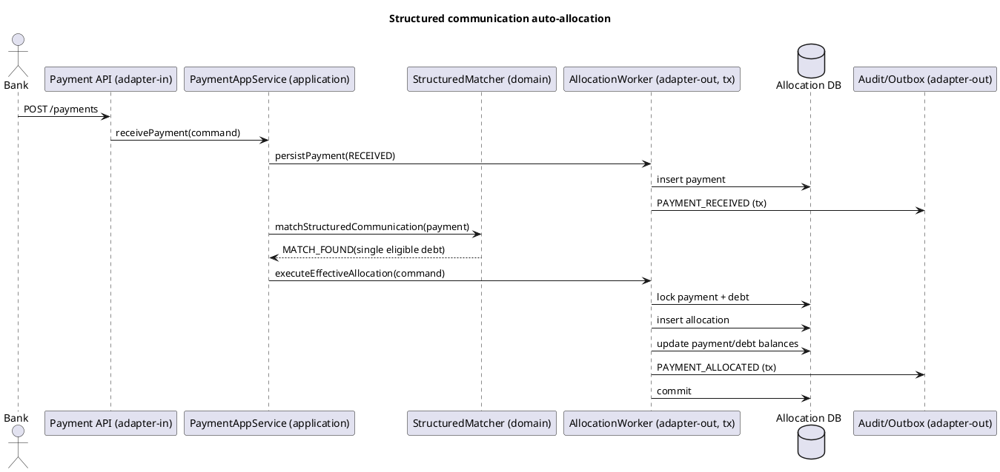
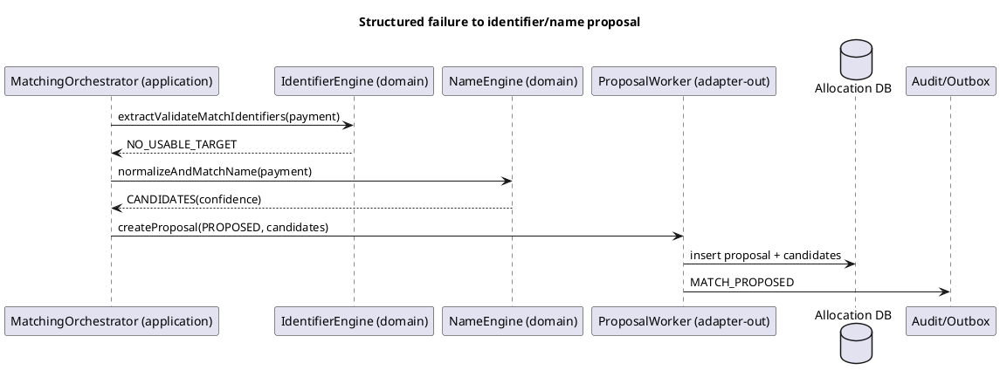
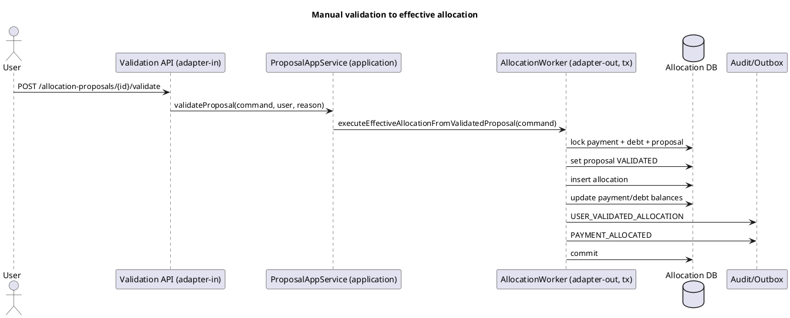
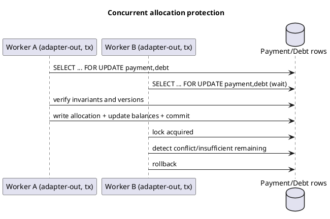

# Technical Analysis - Payment Allocation to Debts

## 1) Scope and context
This document uses the precedence contract in `knowledge/README.md`: because `knowledge/confluence-list-page-id.md` exists, Confluence page IDs listed there are authoritative and must be used (`7078052229`, `7091912737`). [source: knowledge/README.md] [source: knowledge/confluence-list-page-id.md] [source: confluence:7078052229] [source: confluence:7091912737]

Business scope is the end-to-end allocation lifecycle: payment intake, strict-priority matching, proposal creation for non-structured matching, HTML user validation, effective allocation, balance updates, overpayment policy, and auditability. [source: confluence:7078052229] [source: confluence:7091912737]

Non-conflicting harmonized rule set:
1. Matching priority is strict: structured communication, then identifier-based, then name-based.
2. Only valid and unambiguous structured communication can auto-allocate.
3. Identifier/name matching can only create proposals and always requires user validation before effective allocation.
4. If structured matching succeeds, fallback matching is not executed. [source: confluence:7078052229] [source: confluence:7091912737]

Architecture context is hexagonal: domain/application/adapters/bootstrap; transactional boundaries are implemented in adapter-out worker components for effective allocation operations. [source: confluence:7091912737]

## 2) Functional analysis per user story flow
### Flow A - Intake and structured matching (US-001, US-002, US-003)
1. Receive bank payment (`paymentId`, `bankTransactionReference`, amount, currency, payer data, communications).
2. Validate uniqueness and amount/currency constraints.
3. Persist payment as `RECEIVED`, `remainingAmount = amount`.
4. Trigger matching.
5. Execute structured communication normalization/validation/match first.
6. If exactly one eligible debt is found (`OPEN` or `PARTIALLY_PAID`, matching currency), proceed to automatic effective allocation.
7. If structured matching fails (absent/invalid/no match/ambiguous/ineligible debt), set payment to `TO_MATCH` and continue with identifier flow. [source: confluence:7078052229] [source: confluence:7091912737]

### Flow B - Identifier extraction and proposal path (US-004 to US-007, US-010)
1. Extract NISS/BCE/VAT candidates from free communication.
2. Normalize and validate candidates with Belgian rules.
3. Match active debtor(s) and eligible debt(s).
4. Create `AllocationProposal` (`PROPOSED`) for usable candidate sets.
5. Update payment status to `MATCH_PROPOSED`.
6. Do not mutate payment/debt balances in proposal flow.
7. Do not auto-allocate, even with single debtor + single debt. [source: confluence:7078052229] [source: confluence:7091912737]

### Flow C - Name extraction/matching fallback proposal path (US-008, US-009, US-010)
1. Normalize payer/free-text names.
2. Match by confidence (`EXACT_MATCH`, `STRONG_MATCH`, `WEAK_MATCH`, `NO_MATCH`).
3. Create proposal(s) for candidate debtor/debt options.
4. Keep manual validation mandatory; no automatic allocation from name matching. [source: confluence:7078052229] [source: confluence:7091912737]

### Flow D - User validation UI and decisions (US-011 to US-014)
1. Show HTML validation screen titled `Payment Allocation Validation`.
2. Display payment/debtor/debt data with masking for sensitive fields.
3. Allow user actions: validate allocation, reject, select another debt, mark unmatched, request investigation.
4. Enforce permissions and mandatory reasons where specified.
5. Record all user decisions in audit trail. [source: confluence:7078052229] [source: confluence:7091912737]

### Flow E - Effective allocation, balances, overpayment, audit (US-015 to US-019)
1. Trigger effective allocation from structured auto-match or validated proposal.
2. Execute atomic transaction for allocation + payment update + debt update.
3. Apply overpayment policy when payment exceeds debt remaining amount.
4. Enforce concurrency/idempotency constraints.
5. Persist mandatory audit events for matching/allocation/sensitive access. [source: confluence:7078052229] [source: confluence:7091912737]

## 3) Domain model and state transitions
### Core domain objects
| Object | Purpose |
|---|---|
| `Payment` | Incoming payment intake and allocation consumption tracking |
| `Debt` | Settlement target with remaining amount and status |
| `Debtor` | Person/enterprise identity reference for matching |
| `AllocationProposal` | Manual validation candidate container |
| `AllocationProposalCandidate` | Multiple debtor/debt options for ambiguous matches |
| `PaymentAllocation` | Effective settlement record |
| `AuditEvent` | Immutable business/technical trace |
| `NationalNumberAccessLog` | Trace of full NISS display access |
[source: confluence:7078052229] [source: confluence:7091912737]

### State transitions
| Entity | Transitions |
|---|---|
| `Payment` | `RECEIVED -> TO_MATCH -> MATCH_PROPOSED -> ALLOCATED` or `PARTIALLY_ALLOCATED`; alternate outcomes `UNMATCHED`, `INVESTIGATION_REQUIRED`, `REJECTED` |
| `Debt` | `OPEN -> PARTIALLY_PAID -> PAID`; non-allocatable states include `CANCELLED`, `DISPUTED`, `SUSPENDED` |
| `AllocationProposal` | `PROPOSED -> VALIDATED` or `REJECTED`; also `EXPIRED`/`CANCELLED` |
| `PaymentAllocation` | Created as effective allocation with `ALLOCATED` status on success |
[source: confluence:7078052229] [source: confluence:7091912737]

### Allocation invariants
1. `SUM(allocation.amount where allocation.status != CANCELLED) <= payment.amount`
2. `SUM(allocation.amount where allocation.status != CANCELLED) <= debt.originalAmount + allowedCosts`
3. `payment.remainingAmount >= 0`
4. `debt.remainingAmount >= 0` unless an explicit overpayment policy allows a different handling path. [source: confluence:7078052229] [source: confluence:7091912737]

## 4) API contract proposals
API contracts are aligned to the SAD API direction and kept consistent with epic constraints (HTML validation flow; no automatic allocation for identifier/name methods). [source: confluence:7078052229] [source: confluence:7091912737]

| Endpoint | Purpose | Notes |
|---|---|---|
| `POST /payments` | Receive and persist incoming payment | Validates uniqueness, amount, currency; triggers matching |
| `GET /payments/{id}` | Read payment details | Sensitive fields masked by default |
| `POST /payments/{id}/match` | Trigger/retry full matching flow | Safe retry behavior |
| `POST /payments/{id}/match/structured-communication` | Structured-only match | May auto-allocate if valid/unambiguous |
| `POST /payments/{id}/match/identifier` | Identifier extraction/validation/match | Proposal-only |
| `POST /payments/{id}/match/name` | Name match | Proposal-only |
| `GET /payments/{id}/proposals` | List proposals for payment | For validation UI |
| `GET /allocation-proposals/{id}` | Read one proposal and candidates | For validation UI |
| `POST /allocation-proposals/{id}/validate` | Validate selected proposal | Requires permission, selected debtor/debt, amount, reason |
| `POST /allocation-proposals/{id}/reject` | Reject proposal | Reason required |
| `POST /allocation-proposals/{id}/select-debt` | Choose another eligible debt | Audited |
| `POST /allocation-proposals/{id}/mark-unmatched` | Mark payment unmatched | Sets `UNMATCHED` |
| `POST /allocation-proposals/{id}/request-investigation` | Escalate to investigation | Sets `INVESTIGATION_REQUIRED` |
| `POST /allocations` | Execute effective allocation command | Internal command; idempotent; concurrency-safe |
| `GET /allocations/{id}` | Read allocation | Read-only |
| `GET /debtors/{id}/debts` | List allocatable debts for debtor | Filter `OPEN`/`PARTIALLY_PAID` |
| `GET /debts/{id}` | Read debt details | Read-only |
[source: confluence:7091912737] [source: confluence:7078052229]

### API deviation and open decision register
| Item | Status | Owner to confirm | Decision deadline |
|---|---|---|---|
| `POST /allocation-proposals/{id}/mark-unmatched` and `POST /allocation-proposals/{id}/request-investigation` are modeled as explicit endpoints to reflect US-013 outcomes; SAD lists outcome states but does not mandate endpoint shape. | Open deviation requiring API governance approval | Product owner + API architect | Before OpenAPI freeze |
| `POST /allocations/{id}/cancel` exists in SAD as legally constrained; epic stories do not define cancellation implementation behavior. | Open scope decision | Product owner + legal/compliance | Before release scope lock |
[source: confluence:7078052229] [source: confluence:7091912737]

## 5) Business rules and validations (Belgian structured comm, NISS, BCE/VAT, name matching)
### Belgian structured communication
1. Normalize: remove visual separators and keep digits only.
2. Require exactly 12 digits.
3. Validation: `base = first 10 digits`, `check = last 2 digits`, `expected = base mod 97`, `if expected = 0 then expected = 97`, valid when `expected == check`.
4. Only valid + unambiguous + eligible debt match may auto-allocate. [source: confluence:7078052229] [source: confluence:7091912737]

### Belgian national number (NISS)
1. Normalize to exactly 11 digits.
2. Pre-2000 rule: `expected = 97 - (first9 mod 97)`.
3. Post-2000 rule: `expected = 97 - (("2" + first9) mod 97)`.
4. Reject invalid length, non-numeric values, invalid sequence, invalid checksum. [source: confluence:7078052229] [source: confluence:7091912737]

### Belgian enterprise number / VAT
1. Remove `BE` prefix for VAT.
2. Remove accepted separators.
3. Require exactly 10 digits.
4. First digit must be `0` or `1`.
5. Validation: `base = first 8 digits`, `expected = 97 - (base mod 97)`, `if expected = 0 then expected = 97`, valid when expected equals last two digits. [source: confluence:7078052229] [source: confluence:7091912737]

### Name matching
1. Normalize uppercase, trim, remove duplicate spaces, remove punctuation/accents, normalize hyphens as spaces.
2. Classify confidence as `EXACT_MATCH`, `STRONG_MATCH`, `WEAK_MATCH`, `NO_MATCH`.
3. Name matching never auto-allocates and always requires proposal validation. [source: confluence:7078052229] [source: confluence:7091912737]

## 6) Concurrency, idempotency, locking, transaction boundaries
### Idempotency strategy
1. Unique constraint on `Payment.bankTransactionReference`.
2. Unique idempotency key for effective allocation command (`paymentId + debtId + commandId` or equivalent stable key).
3. Retry-safe matching commands for non-mutating or proposal-only operations. [source: confluence:7078052229] [source: confluence:7091912737]

### Locking strategy
1. Optimistic locking (`@Version`) on mutable aggregates (`Payment`, `Debt`, `AllocationProposal`).
2. Pessimistic locking (`PESSIMISTIC_WRITE`) for high-contention effective allocation updates on selected payment/debt rows.
3. Re-check invariants inside lock scope before commit. [source: confluence:7091912737]

### Transaction boundaries (hexagonal-compliant)
1. `adapter-in` controller receives command and calls application use case.
2. `application` orchestrates domain decisions and invokes outbound port for persistence execution.
3. `adapter-out` transactional worker starts transaction (`@Transactional`) and performs atomic writes: `PaymentAllocation` insert, `Payment` update, `Debt` update, proposal status update (if manual), audit/outbox write.
4. Any failure rolls back all writes in the allocation unit. [source: confluence:7078052229] [source: confluence:7091912737]

### Atomicity model note
Target implementation for readiness is same-boundary atomic update of payment/debt/allocation in one transaction; if debt ownership is external, reservation/commit protocol becomes a blocker and must be finalized before build completion. [source: confluence:7091912737]

### SAD architecture boundary obligations
1. Payment Allocation must stay aligned with Perception-Payment ownership and avoid duplicating generic payment lifecycle responsibilities without explicit ownership assignment.
2. Debt balance updates must occur either in the same transactional boundary as authoritative debt data, or through a formally specified reservation/commit protocol that prevents distributed inconsistency.
3. Allocation/accounting coupling is forbidden in the matching transaction; post-commit integration events must be published to Bookkeeping using outbox/eventing patterns.
4. Debtor identity data is treated as reference data and must be consumed with privacy protections and minimal exposure. [source: confluence:7091912737]

## 7) Security/privacy and auditing
### Access control
Required permissions:
1. `VIEW_PAYMENT_ALLOCATION`
2. `VALIDATE_PAYMENT_ALLOCATION`
3. `REJECT_PAYMENT_ALLOCATION_PROPOSAL`
4. `VIEW_FULL_NATIONAL_NUMBER`
5. `CANCEL_PAYMENT_ALLOCATION` (only where legal/operational rules allow cancellation path)
   [source: confluence:7078052229] [source: confluence:7091912737]

### IAM integration constraints
1. Authentication/authorization must integrate with OAuth2/OIDC IAM V2.
2. Validation screen and write operations must enforce role checks at API boundary and use-case boundary.
3. Unauthorized sensitive access and denied write actions must be auditable. [source: confluence:7091912737]

### Privacy controls
1. NISS masked by default in UI.
2. Full NISS display requires dedicated permission and mandatory reason.
3. Full NISS view must be audited (`userId`, timestamp, payment, debtor, reason).
4. Payer IBAN masked by default.
5. National number storage must use encrypted full value plus hash/HMAC lookup representation for exact matching without clear-text indexing.
6. Sensitive data protected at rest and filtered in API responses by permission. [source: confluence:7078052229] [source: confluence:7091912737]

### Allocation cancellation governance
If allocation cancellation is enabled, it must require `CANCEL_PAYMENT_ALLOCATION`, mandatory reason, legal eligibility checks, compensating balance logic, and full audit trace before state mutation. [source: confluence:7091912737]

### Mandatory audit events
`PAYMENT_RECEIVED`, structured normalization/validation/rejection events, identifier extraction/validation/rejection, name match attempt, `MATCH_PROPOSED`, user validation/rejection events, `PAYMENT_ALLOCATED`, unmatched/investigation events, and `NATIONAL_NUMBER_FULL_VIEWED`. [source: confluence:7078052229] [source: confluence:7091912737]

### Audit reliability rule
Effective allocation path must be fail-safe: audit record persistence is part of the same transactional consistency envelope (direct table write or outbox pattern persisted in the same transaction). [source: confluence:7091912737]

## 8) NFRs and observability
### NFR baseline
1. Correctness: no definitive allocation on ambiguous/insufficient evidence.
2. Idempotency and concurrency safety.
3. Full auditability and privacy controls.
4. Availability and retry resilience.
5. Scalability for high-volume payment processing (SAD references peak-scale context).
6. Deterministic, testable business rules.
7. API governance aligned with Belgif REST / OpenAPI direction. [source: confluence:7091912737] [source: confluence:7078052229]

### Observability baseline
1. Metrics: intake rate, duplicate rejection rate, match outcomes by method, proposal queue depth/age, allocation success/failure/rollback, lock wait/conflict counts, overpayment policy distribution.
2. Logs: command correlation, validation failures, authorization denials, sensitive-data access attempts.
3. Tracing: end-to-end spans for intake -> matching -> proposal -> validation -> allocation.
4. Alerts: allocation rollback spikes, audit write failures, prolonged lock contention, rising unmatched/investigation rates. [source: confluence:7091912737] [source: confluence:7078052229]

### Operability and sizing constraints
1. Use SAD baseline deployment sizing as initial capacity reference for API/worker/UI and validate with load tests before production tuning.
2. Design for high-volume context (around 700k payment items/day pending BUCA confirmation) with independent horizontal scaling of matching workers.
3. Keep database pool and lock-contention budgets observable and tunable by environment.
4. Ensure degraded mode does not corrupt allocation state if matching/validation components are temporarily unavailable. [source: confluence:7091912737]

### Measurable readiness checks
1. Throughput test proves target sustained intake/matching rate with no invariant violations.
2. Concurrency test suite proves no negative `remainingAmount` and no duplicate effective allocation under contention.
3. Security test suite proves masking defaults, permission enforcement, and audited full-NISS access path.
4. Operational test proves audit/outbox failure handling is fail-safe for effective allocation.
5. API conformance checks confirm Belgif/OpenAPI compliance and approved deviations list closure. [source: confluence:7091912737] [source: confluence:7078052229]

## 8.1) Data governance alignment
### Retention and minimization
1. Payment, allocation, and proposal records follow legal/accounting retention baseline (default 10 years unless legal validation updates policy).
2. National-number access logs follow at least audit retention policy.
3. Raw bank messages are retained per evidence policy and minimized in operational views.
4. Audit metadata must avoid unnecessary clear-text sensitive values. [source: confluence:7091912737]

### Secure identifier persistence
1. National number is persisted as encrypted value for controlled display plus hash/HMAC for lookup.
2. Identifier matching services use normalized secure representations and never rely on clear-text indexed fields.
3. Export paths must enforce role-based filtering to prevent unauthorized personal identifier extraction. [source: confluence:7091912737] [source: confluence:7078052229]

## 9) Edge cases and error handling
| Edge case | Expected handling |
|---|---|
| Duplicate `bankTransactionReference` | Reject duplicate intake; keep idempotent result |
| Non-positive amount / non-EUR | Reject at intake validation |
| Structured communication invalid length/checksum | Reject structured path; continue fallback |
| Structured valid but no debt / multiple debts | No auto-allocation; fallback or proposal path |
| Debt not allocatable (`PAID`, `CANCELLED`, etc.) | Treat as structured failure for allocation |
| Multiple identifiers in free text | Mark ambiguous; require review/proposal |
| Valid identifier but inactive debtor | No allocation; proposal/review path only |
| Validation command missing reason or selection | Reject command with validation error |
| Unauthorized validation/full NISS view | Deny access and audit denial |
| Overpayment occurs | Apply configured policy only |
| Concurrent validations on same payment/debt | One succeeds, conflicting one fails and rolls back |
| Allocation write failure | Full transaction rollback; no partial balance changes |
[source: confluence:7078052229] [source: confluence:7091912737]

## 10) Technical acceptance criteria
1. Intake creates `RECEIVED` payment with correct initial remaining amount and uniqueness checks.
2. Structured matching executes before identifier/name matching.
3. Only structured valid+unambiguous path can auto-allocate.
4. Identifier and name paths always create proposal(s) and never allocate directly.
5. Proposal creation does not update debt/payment balances.
6. HTML validation screen displays required payment/debtor/debt data with masking rules.
7. Manual validation requires permission, selected debtor/debt, valid amount, and reason.
8. Effective allocation is atomic and updates allocation/payment/debt consistently.
9. Overpayment behavior is strictly policy-driven.
10. Concurrency tests prove invariant preservation and no duplicate effective allocations.
11. Audit tests prove required event emission including sensitive access logs. [source: confluence:7078052229] [source: confluence:7091912737]

### Traceability matrix (user stories/FR -> architecture/API/tests)
| US / FR | Architecture mapping | API mapping | Test mapping |
|---|---|---|---|
| US-001 / FRQ-001 | Payment intake use case + payment repository + audit port | `POST /payments` | uniqueness, amount/currency, initial status |
| US-002 / FRQ-002 | Structured validator/matcher domain service | `POST /payments/{id}/match/structured-communication` | normalization/checksum/single-match |
| US-003 / FRQ-003 | Matching orchestrator fallback | `POST /payments/{id}/match` | structured failure transitions |
| US-004-006 / FRQ-004-006 | Identifier extractor + Belgian validators | `POST /payments/{id}/match/identifier` | NISS/BCE/VAT extraction and checksum cases |
| US-007 / FRQ-007 | Identifier debtor/debt resolver + proposal factory | `POST /payments/{id}/match/identifier` | active/inactive debtor, debt eligibility |
| US-008-009 / FRQ-008-009 | Name normalizer + confidence matcher | `POST /payments/{id}/match/name` | exact/strong/weak/no-match classification |
| US-010 / FRQ-010 | Proposal manager | `GET /payments/{id}/proposals` | `PROPOSED` status and payment transition |
| US-011 / FRQ-011 | Validation read model + HTML UI adapter-in | `GET /allocation-proposals/{id}` | masking and displayed fields |
| US-012 / FRQ-012 | Manual validation use case + allocation trigger | `POST /allocation-proposals/{id}/validate` | permission, reason, amount, selections |
| US-013 / FRQ-013 | Rejection/escalation use cases | reject/mark-unmatched/investigation endpoints | reason required and status changes |
| US-014 / FRQ-014 | Sensitive access guard + access log adapter-out | full NISS view action | permission + reason + audit |
| US-015-016 / FRQ-015-016 | Allocation engine + balance updater | `POST /allocations` | atomicity and status transitions |
| US-017 / FRQ-017 | Overpayment policy handler | `POST /allocations` | policy-specific outcomes |
| US-018 / FRQ-018 | Idempotency and locking infrastructure | `POST /allocations` | concurrent execution tests |
| US-019 / FRQ-019 | Audit event publisher/outbox | all write commands | mandatory audit coverage |
[source: confluence:7078052229] [source: confluence:7091912737]

## 11) Open questions / assumptions
### Assumptions
1. Incoming payments have stable unique `bankTransactionReference`.
2. Intake scope is positive EUR payments.
3. IAM and audit infrastructure are available.
4. Structured communication remains the only auto-allocation-safe method. [source: confluence:7091912737]

### Open questions
1. Final ownership and transactional boundary for debt balance updates.
2. Final production database choice.
3. Default overpayment policy per business domain.
4. Final volume/SLO confirmation for sizing.
5. Whether allocation cancellation (`POST /allocations/{id}/cancel`) is in-scope for this implementation increment and which legal rules apply. [source: confluence:7078052229] [source: confluence:7091912737]
6. Final standardized API error code catalog. [source: confluence:7091912737]

### Readiness assessment (implementation readiness with blockers/risks/next actions)
Implementation readiness is **partially ready**: functional behavior is clear and consistent, but architecture/infrastructure decisions still gate full execution readiness. [source: confluence:7078052229] [source: confluence:7091912737]

Blockers:
1. Unresolved final debt ownership/atomicity contract.
2. Overpayment default policy not frozen.
3. Production persistence/platform confirmation pending. [source: confluence:7091912737]

Risks:
1. Cross-boundary consistency risk if debt updates are external without reservation/commit.
2. Privacy compliance risk if full NISS access flow is incomplete.
3. Throughput risk until volume assumptions are validated with load tests. [source: confluence:7091912737]

Next actions:
1. Close open architecture decisions and record ADRs.
2. Freeze OpenAPI contracts and validation/error model.
3. Implement vertical slices in order: intake -> structured auto-allocation -> identifier/name proposal -> manual validation -> overpayment -> concurrency hardening -> audit hardening.
4. Execute concurrency and fail-safe audit integration tests before go-live. [source: confluence:7078052229] [source: confluence:7091912737]

## 12) Sequence diagrams in PlantUML for key flows

[source: confluence:7078052229] [source: confluence:7091912737]

[source: confluence:7078052229] [source: confluence:7091912737]

[source: confluence:7078052229] [source: confluence:7091912737]

[source: confluence:7078052229] [source: confluence:7091912737]
