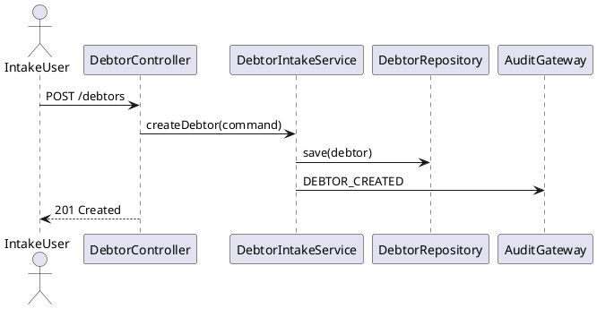
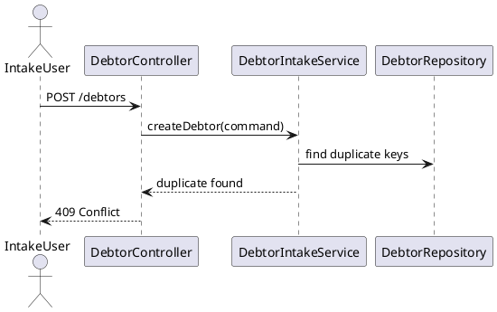
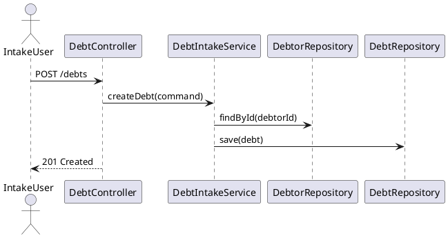
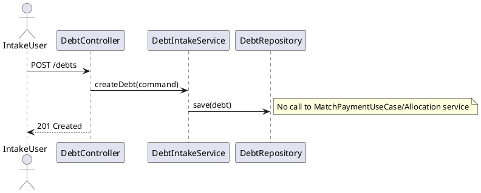
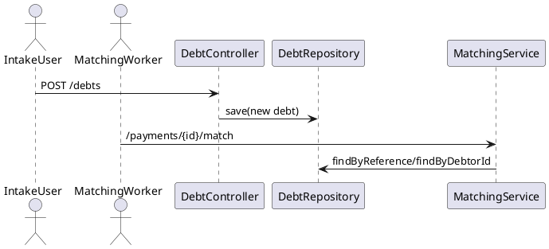
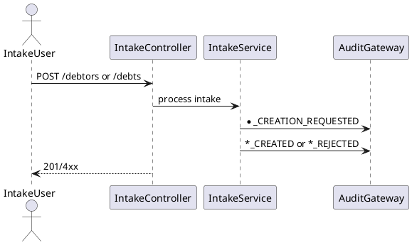

# Extension Analysis

**Trigger mode:** extension-business  
**SAD check:** with-sad  
**Date:** 2026-06-30  
**Author:** technical-functional-analyst

## 1. Trigger

### 1.1 Source

Authoritative new scope files from inbox:

- `knowledge/inbox/confluence-list-page-id.md` (lists page IDs `7117963683`, `7116980899`). [source: knowledge/inbox/confluence-list-page-id.md]
- `confluence:7117963683` (new business epic: debtor/debt intake lifecycle). [source: confluence:7117963683]
- `confluence:7116980899` (SAD v2 addendum bringing intake lifecycle in scope). [source: confluence:7116980899]

Historical baseline context:

- `knowledge/baseline/confluence-list-page-id.md` (`7078052229`, `7091912737`). [source: knowledge/baseline/confluence-list-page-id.md]
- `confluence:7078052229` (existing payment-allocation epic). [source: confluence:7078052229]
- `confluence:7091912737` (baseline SAD). [source: confluence:7091912737]
- Existing plans: `.opencode/plans/technical-analysis.md`, `.opencode/plans/architecture-plan.md`. [source: .opencode/plans/technical-analysis.md] [source: .opencode/plans/architecture-plan.md]

### 1.2 Summary

The new scope adds upstream **Debtor and Debt Intake** capabilities (create debtor, prevent duplicate debtor, create debt linked to debtor, keep intake decoupled from allocation, make eligible debt discoverable for future matching, and audit intake lifecycle) while preserving the existing payment-driven allocation flow. [source: confluence:7117963683] [source: confluence:7116980899] [source: confluence:7078052229]

### 1.3 Mode-switch recommendation

**Confirm extension-business**. The inbox scope is mainly additive (new intake APIs and lifecycle) and explicitly preserves existing allocation behavior and priority rules. A refactor-mode switch is **not** recommended. [source: confluence:7117963683] [source: confluence:7116980899]

## 2. New business scope

### 2.1 Epic

- **Epic title:** Debtor and Debt Intake for Payment Allocation (Pre-Allocation Scope)
- **Business objective:** Provide prerequisite reference-data intake before payment matching/allocation.
- **Business value:** Increase data quality, traceability, and readiness of future payment matching.
- **Priority:** High (scope-expanding SAD v2 item). [source: confluence:7117963683] [source: confluence:7116980899]

### 2.2 Features

| Feature | Description | Priority |
|---|---|---|
| F1 Debtor intake | Create debtor with type-specific mandatory identity data and uniqueness controls | High |
| F2 Debt intake | Create debt linked to existing debtor with validation and uniqueness policy | High |
| F3 Allocation decoupling | Guarantee debtor/debt creation never triggers matching/allocation | High |
| F4 Intake auditability | Audit request/success/rejection/duplicate events for debtor/debt intake | High |

### 2.3 User stories

#### User Story [US-DI-001 — Create Debtor]

##### 1. Context and Objective

- Add debtor-creation capability for person/enterprise before payment allocation lifecycle. [source: confluence:7117963683]
- Align with SAD v2 in-scope debtor lifecycle and controlled APIs. [source: confluence:7116980899]

##### 2. Detailed Functional Specifications

- Provide create-debtor command with debtor type and mandatory fields by type.
- Assign unique debtor UUID.
- Default state active unless policy overrides.
- No allocation process trigger on success.

##### 3. API Contract

- `POST /debtors` (new)
  - Request: debtor type + identity payload.
  - Response: created debtor summary with identifier.
  - Errors: 400 invalid payload, 409 duplicate debtor.
  - Security: authorized intake role required.
  - Audit: `DEBTOR_CREATION_REQUESTED`, `DEBTOR_CREATED`, `DEBTOR_CREATION_REJECTED`.
  [source: confluence:7116980899] [source: confluence:7117963683]

##### 4. Data Model

- Reuse `debtor` table (`DebtorEntity`) and add lifecycle write support through repository/service layer.
- Existing columns already support type, display name, identifiers, active flag. [source: adapter-out/src/main/java/com/pipelinepro/adapter/out/persistence/entity/DebtorEntity.java:23]

##### 5. Business Rules and Validations

- BR-DI-001: Debtor type must be person or legal entity.
- BR-DI-002: Mandatory identity fields depend on debtor type.
- BR-DI-003: Debtor identifier must be unique.
- BR-DI-004: Debtor creation does not trigger allocation flow.
  [source: confluence:7117963683] [source: confluence:7116980899]

##### 6. Error Management

- Invalid mandatory fields → 400 with business validation message.
- Duplicate debtor policy hit → 409 with duplicate reason.
- Unexpected persistence error → 500, audit failure reason.

##### 7. Edge Cases

- Same identity submitted concurrently.
- Natural person with enterprise identifier only.
- Enterprise with malformed BCE/VAT format.
- Empty display name after normalization.

##### 8. Dependencies

- Domain: new intake use case + command.
- Adapter-in: new debtor controller endpoint.
- Adapter-out: debtor write repository method.
- IAM authorization and audit gateway.

##### 9. Technical Acceptance Criteria

- `createDebtor_withValidNaturalPerson_returns201`
- `createDebtor_withMissingMandatoryData_returns400`
- `createDebtor_withDuplicateIdentity_returns409`
- `createDebtor_doesNotTriggerAllocationFlow`
- `createDebtor_auditsRequestAndOutcome`

##### 10. UML Sequence Diagram

#### User Story [US-DI-002 — Prevent Invalid or Duplicate Debtor Registration]

##### 1. Context and Objective

- Enforce identity quality and duplicate prevention before debtor persistence. [source: confluence:7117963683]

##### 2. Detailed Functional Specifications

- Validate identity format and completeness.
- Execute duplicate detection based on configured business keys.
- Block or flag per policy (initial implementation: block with explicit reason).

##### 3. API Contract

- Same endpoint `POST /debtors`; duplicate outcomes become deterministic `409` contract.
- Add optional duplicate-detection metadata in error payload.

##### 4. Data Model

- Preserve existing unique constraints:
  - `uk_debtor_national_number_hash`
  - `uk_debtor_enterprise_number`
  [source: adapter-out/src/main/java/com/pipelinepro/adapter/out/persistence/entity/DebtorEntity.java:25]

##### 5. Business Rules and Validations

- BR-DI-005: Invalid identity data is rejected.
- BR-DI-006: Duplicate debtor creation is prevented.
  [source: confluence:7117963683]

##### 6. Error Management

- Validation failure: 400.
- Duplicate detected: 409 + code `DUPLICATE_DEBTOR_DETECTED`.

##### 7. Edge Cases

- Same national number in different formatting.
- Enterprise number with BE prefix vs digits-only.

##### 8. Dependencies

- Identifier normalization/validation value objects.
- Repository lookup before save.

##### 9. Technical Acceptance Criteria

- `createDebtor_duplicateNationalNumber_returns409`
- `createDebtor_duplicateEnterpriseNumber_returns409`
- `createDebtor_invalidIdentity_returns400`

##### 10. UML Sequence Diagram

#### User Story [US-DI-003 — Create Debt Linked to Existing Debtor]

##### 1. Context and Objective

- Add debt-intake capability linked to an existing debtor identifier. [source: confluence:7117963683] [source: confluence:7116980899]

##### 2. Detailed Functional Specifications

- Accept debt creation request with debtorId, reference, amount, currency, due date, status.
- Validate debtor existence before save.
- Enforce amount > 0 and debt reference uniqueness policy.

##### 3. API Contract

- `POST /debts` (new)
  - Request: debtorId + debt payload.
  - Response: created debt resource.
  - Errors: 400 invalid debt, 404 debtor not found, 409 duplicate debt reference policy.
  [source: confluence:7116980899] [source: confluence:7117963683]

##### 4. Data Model

- Reuse `debt` table (`debtor_id`, `reference`, `original_amount`, `remaining_amount`, `currency`, `status`, timestamps).
- Existing FK `fk_debt_debtor` and unique debtor+reference constraint already available. [source: adapter-out/src/main/java/com/pipelinepro/adapter/out/persistence/entity/DebtEntity.java:30]

##### 5. Business Rules and Validations

- BR-DI-007: Debt requires existing debtor.
- BR-DI-008: Debt amount strictly positive.
- BR-DI-009: Debt reference uniqueness per debtor policy.
  [source: confluence:7117963683]

##### 6. Error Management

- Unknown debtorId → 404.
- Invalid debt fields → 400.
- Duplicate debt reference → 409.

##### 7. Edge Cases

- Concurrent debt creation with same debtor/reference.
- Debtor exists but inactive status (policy-dependent allow/block).
- Currency outside allowed policy.

##### 8. Dependencies

- Debtor lookup repository.
- Debt repository save path.
- Audit gateway.

##### 9. Technical Acceptance Criteria

- `createDebt_forExistingDebtor_returns201`
- `createDebt_unknownDebtor_returns404`
- `createDebt_invalidAmount_returns400`
- `createDebt_duplicateReference_returns409`
- `createDebt_auditsRequestAndOutcome`

##### 10. UML Sequence Diagram

#### User Story [US-DI-004 — Debt Intake Does Not Trigger Allocation]

##### 1. Context and Objective

- Preserve strict separation: intake lifecycle is independent from payment-driven allocation. [source: confluence:7117963683] [source: confluence:7116980899]

##### 2. Detailed Functional Specifications

- Debtor/debt creation must not call payment matching or allocation use cases.
- No status mutation on existing payments/proposals due to intake.

##### 3. API Contract

- No new endpoint required beyond `POST /debtors` and `POST /debts`.
- Contract rule: side-effect exclusion on allocation domain.

##### 4. Data Model

- No writes to `payment`, `allocation_proposal`, `payment_allocation` tables from intake flows.

##### 5. Business Rules and Validations

- BR-INTAKE-03 and BR-INTAKE-04 are binding.
  [source: confluence:7116980899]

##### 6. Error Management

- If accidental coupling is detected (internal invariant), abort transaction and return 500.

##### 7. Edge Cases

- Existing wiring where intake service reuses matching service by mistake.
- Event listeners unintentionally subscribed to intake events and triggering allocation.

##### 8. Dependencies

- Code-level guard tests against `MatchPaymentUseCase` and `ExecuteAllocationUseCase` invocation from intake services.

##### 9. Technical Acceptance Criteria

- `createDebtor_neverInvokesMatchPayment`
- `createDebt_neverInvokesMatchPayment`
- `createDebt_neverCreatesAllocationProposal`

##### 10. UML Sequence Diagram

#### User Story [US-DI-005 — Make New Debt Available for Future Allocation Flow]

##### 1. Context and Objective

- Ensure newly created eligible debts can be discovered later by existing matching flow (`findByReference`, `findByDebtorId`). [source: confluence:7117963683] [source: application/src/main/java/com/pipelinepro/application/PaymentMatchingApplicationService.java:337]

##### 2. Detailed Functional Specifications

- Debt creation sets initial status and remaining amount consistent with allocatable policy.
- Non-eligible statuses remain excluded from allocation matching until status change.

##### 3. API Contract

- `POST /debts` populates debt records discoverable by existing read/matching APIs:
  - `GET /debtors/{id}/debts`
  - `GET /debts/{id}`
  - matching endpoints under `/payments/{id}/match/*`

##### 4. Data Model

- Reuse `debt.status`, `remaining_amount`, `currency`, `reference` for eligibility and retrieval.

##### 5. Business Rules and Validations

- BR-DI-010: Eligible status allows future matching.
- BR-DI-011: Non-eligible status blocks allocation eligibility.
  [source: confluence:7117963683]

##### 6. Error Management

- Invalid initial status for intake policy → 400.

##### 7. Edge Cases

- Debt with zero remaining amount at creation.
- Reference collisions across different debtors.

##### 8. Dependencies

- Existing debt querying path in `QueryApplicationService`.
- Existing matching filters (`OPEN`, `PARTIALLY_PAID`) in matching service.

##### 9. Technical Acceptance Criteria

- `createDebt_openStatus_isDiscoverableByMatching`
- `createDebt_nonEligibleStatus_notUsedForAllocationCandidates`

##### 10. UML Sequence Diagram

#### User Story [US-DI-006 — Audit Debtor and Debt Intake Lifecycle]

##### 1. Context and Objective

- Add mandatory intake audit events and rejection reasons for traceability. [source: confluence:7117963683] [source: confluence:7116980899]

##### 2. Detailed Functional Specifications

- Emit events for requested/success/rejected/duplicate for both debtor and debt.
- Include actor, timestamp, target aggregate id (when available), and reason.

##### 3. API Contract

- No dedicated read API required in this cycle.
- Write APIs (`POST /debtors`, `POST /debts`) must guarantee audit side effects.

##### 4. Data Model

- Reuse `audit_event` table/entity, currently used by payment allocation flow. [source: adapter-out/src/main/java/com/pipelinepro/adapter/out/persistence/entity/AuditEventEntity.java]

##### 5. Business Rules and Validations

- Mandatory events:
  - `DEBTOR_CREATION_REQUESTED`, `DEBTOR_CREATED`, `DEBTOR_CREATION_REJECTED`
  - `DEBT_CREATION_REQUESTED`, `DEBT_CREATED`, `DEBT_CREATION_REJECTED`
  - `DUPLICATE_DEBTOR_DETECTED`, `DUPLICATE_DEBT_DETECTED`
  [source: confluence:7117963683] [source: confluence:7116980899]

##### 6. Error Management

- If audit append fails, return error and keep transactional consistency for configured policy (to confirm: fail-safe vs compensating retry).

##### 7. Edge Cases

- Duplicate detected before aggregate persistence.
- Partial failure: aggregate persisted but audit failed.

##### 8. Dependencies

- `AuditEventGateway` and mapper/repository chain.

##### 9. Technical Acceptance Criteria

- `createDebtor_emitsRequestedAndCreatedEvents`
- `createDebtor_duplicate_emitsDuplicateEvent`
- `createDebt_rejected_emitsRejectedEventWithReason`

##### 10. UML Sequence Diagram

## 3. Integration points with the existing codebase

### 3.1 Modules

| Module | Why touched | Action (add file / edit existing for wiring) |
|---|---|---|
| `domain` | Add intake use cases and commands for debtor/debt creation | add files |
| `application` | Add intake orchestration services and validation flow | add files |
| `adapter-in` | Add `POST /debtors` and `POST /debts` endpoints and DTOs | add files; optional edit existing package-level config only |
| `adapter-out` | Add save methods for debtor/debt repositories and optional duplicate query methods | edit existing interfaces/impl for wiring |
| `bootstrap` | Register new application services as Spring beans | edit existing wiring (`ApplicationServiceConfig`) |
| `bootstrap/static` | Optional new intake pages for debtor/debt creation | add files |

### 3.2 Classes and files

| Path | Action | What is added |
|---|---|---|
| `domain/src/main/java/com/pipelinepro/domain/port/out/DebtorRepository.java` | edit existing for wiring | `save(...)`, duplicate-check contract methods |
| `domain/src/main/java/com/pipelinepro/domain/port/out/DebtRepository.java` | edit existing for wiring | duplicate-check helper method if needed |
| `application/src/main/java/com/pipelinepro/application/QueryApplicationService.java` | preserve | no behavior change (read-only baseline preserved) |
| `application/src/main/java/com/pipelinepro/application/PaymentMatchingApplicationService.java` | preserve | no algorithm change |
| `adapter-in/src/main/java/com/pipelinepro/adapter/in/web/v1/DebtController.java` | preserve existing read endpoints | keep `GET /debtors/{id}/debts`, `GET /debts/{id}` unchanged |
| `adapter-in/src/main/java/com/pipelinepro/adapter/in/web/v1/` | add files | new `DebtorController` and debt-intake write endpoint/controller |
| `adapter-out/src/main/java/com/pipelinepro/adapter/out/persistence/impl/JpaDebtorRepository.java` | edit existing for wiring | implement save/duplicate operations |
| `adapter-out/src/main/java/com/pipelinepro/adapter/out/persistence/impl/JpaDebtRepository.java` | edit existing for wiring | enforce duplicate policy methods |
| `bootstrap/src/main/java/com/pipelinepro/bootstrap/config/ApplicationServiceConfig.java` | edit existing for wiring | beans for new intake use cases |

### 3.3 Endpoints

| Existing controller path | New endpoints added | Notes |
|---|---|---|
| `/payments` | none | preserved contract |
| `/allocation-proposals` | none | preserved contract |
| `/allocations` | none | preserved contract |
| root (`DebtController`) | `POST /debts` (new) | must not alter existing GET contracts |
| new `DebtorController` | `POST /debtors` (new), optional `GET /debtors/{id}` | additive API from SAD addendum |

### 3.4 Persistence schema

| Existing table | New columns / indexes | Additive? (yes / no — if no, document the decision) |
|---|---|---|
| `debtor` | none required for MVP intake | yes |
| `debt` | none required for MVP intake | yes |
| `audit_event` | optional event-type index for intake events | yes |
| `payment`, `allocation_proposal`, `payment_allocation` | none | yes (preserved) |

### 3.5 Configuration entries

| Configuration file | New entries | Rationale |
|---|---|---|
| `bootstrap/src/main/resources/application.yml` | optional intake-policy config keys (duplicate strategy, allowed debt currencies) | externalize business policy |

## 4. Preserved contract

### 4.1 Preserved public APIs

| Method | Path | Request shape | Response shape | Status codes |
|---|---|---|---|---|
| POST | `/payments` | `ReceivePaymentRequest` | `PaymentResponse` | 201/400/409 |
| GET | `/payments/{paymentId}` | path id | `PaymentDetailsResponse` | 200/404 |
| GET | `/payments/{paymentId}/proposals` | path id | `AllocationProposalListResponse` | 200/404 |
| POST | `/payments/{paymentId}/match` | path id | `MatchResultResponse` | 200/202/409 |
| POST | `/payments/{paymentId}/match/structured-communication` | path id | `StructuredMatchResponse` | 200/202/400/409 |
| POST | `/payments/{paymentId}/match/identifier` | path id | `ProposalCreationResponse` | 200/202/400 |
| POST | `/payments/{paymentId}/match/name` | path id | `ProposalCreationResponse` | 200/202/400 |
| GET | `/allocation-proposals/{proposalId}` | path id | `AllocationProposalResponse` | 200/404 |
| POST | `/allocation-proposals/{proposalId}/validate` | `ValidateProposalRequest` | `AllocationResultResponse` | 200/400/404/409 |
| POST | `/allocation-proposals/{proposalId}/reject` | `RejectProposalRequest` | `ProposalStateResponse` | 200/400/404/409 |
| POST | `/allocation-proposals/{proposalId}/select-debt` | `SelectDebtRequest` | `ProposalStateResponse` | 200/400/404/409 |
| POST | `/allocation-proposals/{proposalId}/mark-unmatched` | `MarkUnmatchedRequest` | `ProposalStateResponse` | 200/400/404/409 |
| POST | `/allocation-proposals/{proposalId}/request-investigation` | `RequestInvestigationRequest` | `ProposalStateResponse` | 200/400/404/409 |
| POST | `/allocations` | `ExecuteAllocationRequest` | `AllocationResultResponse` | 201/400/404/409 |
| GET | `/allocations/{allocationId}` | path id | `AllocationResponse` | 200/404 |
| GET | `/debtors/{debtorId}/debts` | path+optional status | `DebtListResponse` | 200/404 |
| GET | `/debts/{debtId}` | path id | `DebtResponse` | 200/404 |

### 4.2 Preserved persistence schema entries

| Entry | Reason it must be preserved |
|---|---|
| `payment.uk_payment_bank_transaction_reference` | intake idempotency for payment flow |
| `payment_allocation.uk_payment_allocation_idempotency_key` | allocation non-duplication |
| `debt.fk_debt_debtor` | debt ownership integrity |
| `debt.uk_debt_debtor_reference` | debtor-scoped debt uniqueness policy |
| `debtor.uk_debtor_national_number_hash` and `uk_debtor_enterprise_number` | identity uniqueness used by matching |

### 4.3 Preserved observable behaviors

| Behavior | Reason it must be preserved |
|---|---|
| Structured communication remains the only auto-allocation path | core business rule from baseline epic/SAD |
| Identifier/name matching remain proposal-only | legal/risk boundary |
| Matching priority order remains structured → identifier → name | deterministic allocation behavior |
| Existing read endpoints for debt/payment/proposal remain backward compatible | consumers already integrated |
| Allocation transaction atomicity and locking behavior remain unchanged | prevent over-allocation/concurrency regressions |

## 5. Migration considerations

- Data migration: **no** (reuse existing debtor/debt tables; additive-only indexes if needed)
- API versioning: **no** (new endpoints are additive)
- Frontend impact: **yes** (new debtor/debt intake screens or extensions to existing navigation)

Details:

- Existing backend contracts are preserved; no breaking field removal/renaming planned.
- If UI is extended, current payment/proposal screens remain unchanged. [source: bootstrap/src/main/resources/static/payments/intake.html] [source: bootstrap/src/main/resources/static/proposals/validate.html]

## 6. Open questions

- What exact duplicate policy should be used for debtor creation (strict block vs review queue) when partial identity match exists?
- Should inactive debtors be allowed for debt creation, or must intake reject with business error?
- Is debtor update lifecycle (not creation) in scope for this cycle, or deferred?
- Must intake writes fail hard when audit persistence fails, or can audit fallback retry be accepted?
- Is `GET /debtors` search endpoint required now (SAD addendum mentions it), or can it be deferred?

## 7. Readiness

- Readiness level: **Ready with minor clarifications**
- Main blockers:
  - duplicate-policy precision for debtor identity;
  - audit failure policy decision.
- Recommended next actions:
  1. Confirm open policy questions above.
  2. Produce extension plan with additive-first implementation steps.
  3. Keep preserved contract as non-regression gate.
- Mode-switch recommendation: **Confirm extension-business** (no refactor switch required).
