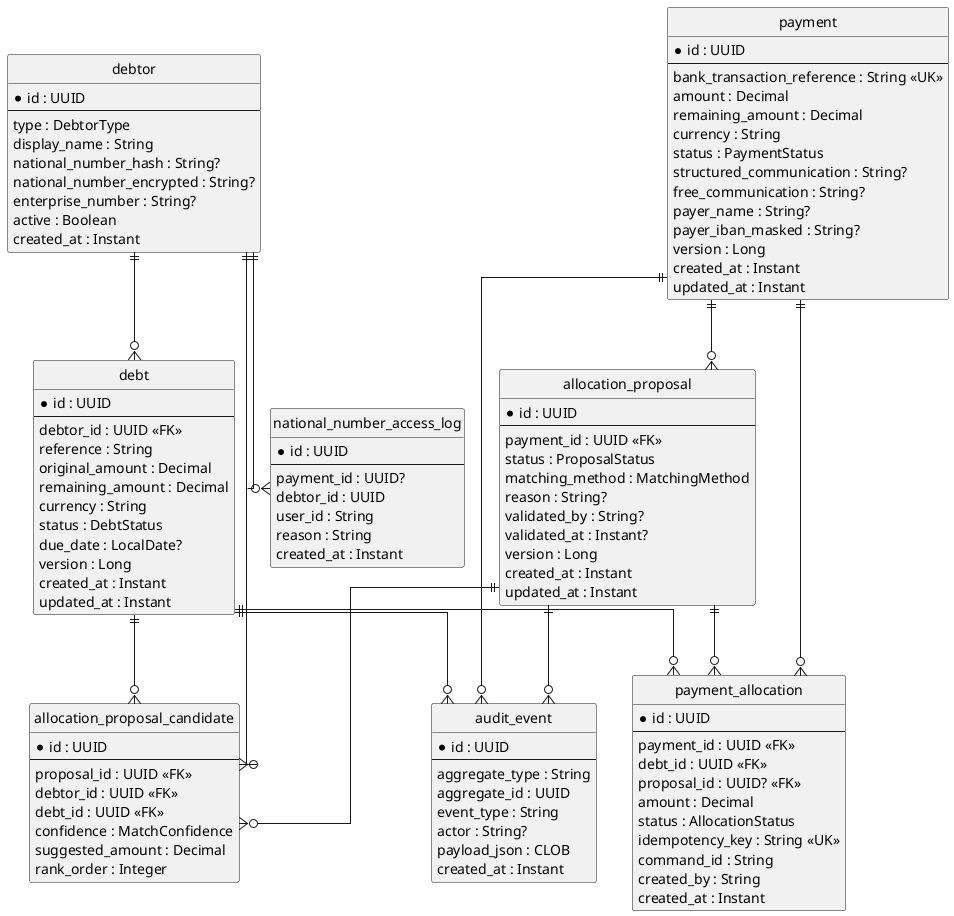
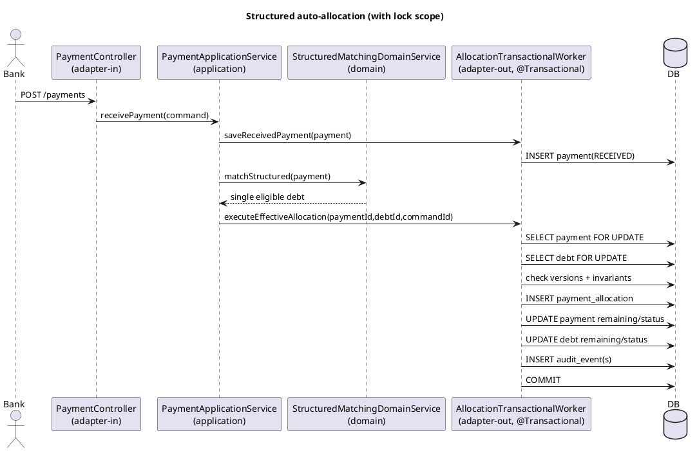
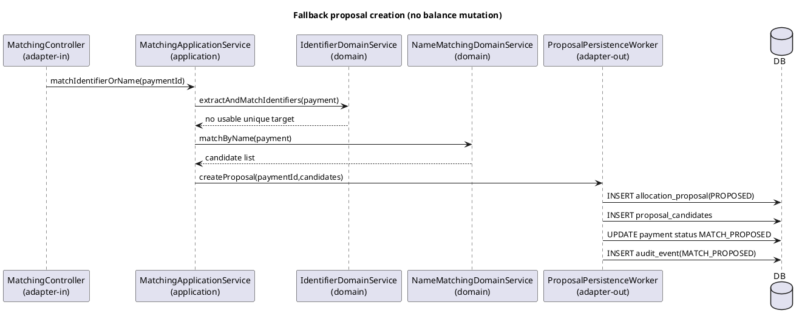
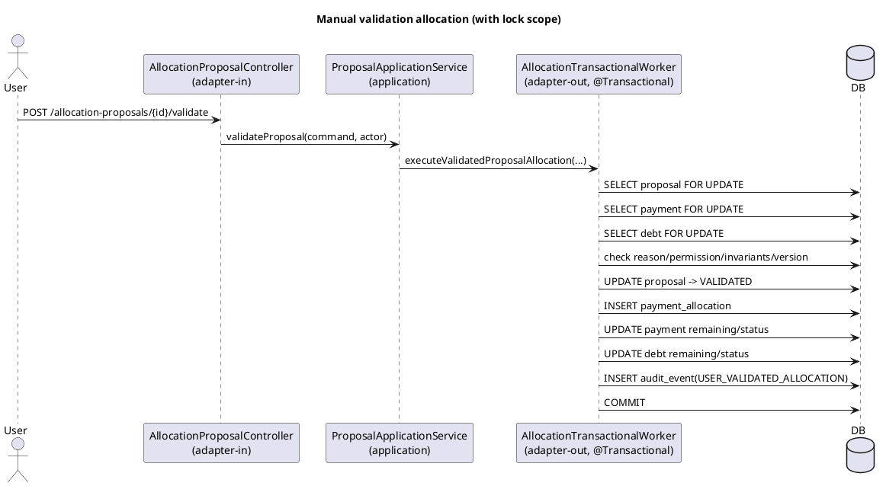

# Architecture Plan - Payment Allocation to Debts (archived)

## 1) Maven multi-module structure

```text
allocation/
├── pom.xml                          # parent aggregator
├── domain/
│   └── pom.xml
├── application/
│   └── pom.xml
├── adapter-in/
│   └── pom.xml
├── adapter-out/
│   └── pom.xml
└── bootstrap/
    └── pom.xml
```

Dependency flow (strict):
- `domain`: no Spring/JPA/web dependencies.
- `application` -> `domain` only.
- `adapter-in` -> `application` (+ `domain` for command/value mapping only).
- `adapter-out` -> `domain` (implements outbound ports, owns transactions).
- `bootstrap` -> all adapters + application for wiring/runtime.

## 2) Data model (PlantUML entity diagram)



## 3) REST API endpoint table

| Method | Path | Request | Response | Status codes |
|---|---|---|---|---|
| POST | `/payments` | `ReceivePaymentRequest` | `PaymentResponse` | `201`, `400`, `409` |
| GET | `/payments/{id}` | Path `id` | `PaymentDetailsResponse` | `200`, `403`, `404` |
| POST | `/payments/{id}/match` | Path `id` | `MatchResultResponse` | `200`, `202`, `404`, `409` |
| POST | `/payments/{id}/match/structured-communication` | Path `id` | `StructuredMatchResponse` | `200`, `202`, `400`, `404`, `409` |
| POST | `/payments/{id}/match/identifier` | Path `id` | `ProposalCreationResponse` | `200`, `202`, `400`, `404` |
| POST | `/payments/{id}/match/name` | Path `id` | `ProposalCreationResponse` | `200`, `202`, `400`, `404` |
| GET | `/payments/{id}/proposals` | Path `id` | `AllocationProposalListResponse` | `200`, `404` |
| GET | `/allocation-proposals/{id}` | Path `id` | `AllocationProposalResponse` | `200`, `403`, `404` |
| POST | `/allocation-proposals/{id}/validate` | `ValidateProposalRequest` | `AllocationResultResponse` | `200`, `400`, `403`, `404`, `409` |
| POST | `/allocation-proposals/{id}/reject` | `RejectProposalRequest` | `ProposalStateResponse` | `200`, `400`, `403`, `404`, `409` |
| POST | `/allocation-proposals/{id}/select-debt` | `SelectDebtRequest` | `ProposalStateResponse` | `200`, `400`, `403`, `404`, `409` |
| POST | `/allocation-proposals/{id}/mark-unmatched` | `MarkUnmatchedRequest` | `ProposalStateResponse` | `200`, `400`, `403`, `404`, `409` |
| POST | `/allocation-proposals/{id}/request-investigation` | `RequestInvestigationRequest` | `ProposalStateResponse` | `200`, `400`, `403`, `404`, `409` |
| POST | `/allocations` | `ExecuteAllocationRequest` | `AllocationResultResponse` | `201`, `400`, `404`, `409` |
| GET | `/allocations/{id}` | Path `id` | `AllocationResponse` | `200`, `403`, `404` |
| GET | `/debtors/{id}/debts` | Path `id`, query filters | `DebtListResponse` | `200`, `403`, `404` |
| GET | `/debts/{id}` | Path `id` | `DebtResponse` | `200`, `403`, `404` |

## 4) Locking strategy table

| Operation | Lock type | Implementation | Rationale |
|---|---|---|---|
| Receive payment intake (`POST /payments`) | Unique constraint + optimistic | DB unique index on `bank_transaction_reference`; `@Version` on `Payment` | Idempotent intake and concurrent duplicate protection with low lock cost |
| Structured auto-allocation write path | Pessimistic write + optimistic recheck | `SELECT ... FOR UPDATE` / JPA `@Lock(PESSIMISTIC_WRITE)` on `Payment` + `Debt`; verify `@Version` and invariants before commit | Prevents double allocation and negative balances under contention |
| Manual proposal validation -> allocation | Pessimistic write + optimistic | Lock `Payment`, `Debt`, `AllocationProposal` rows in one transaction in adapter-out worker | Ensures one winning validator and atomic proposal/balance transitions |
| Proposal reject/select debt/mark unmatched/investigation | Optimistic | `@Version` on `AllocationProposal` | Prevents stale updates while avoiding heavy locks |
| Allocation command idempotency | Unique key lock-free dedupe | Unique index on `payment_id + debt_id + command_id` (or `idempotency_key`) | Retry-safe command execution without duplicate effective allocations |

Transaction placement:
- `@Transactional` only in `adapter-out` worker implementations of outbound ports.
- `application` orchestrates use cases and never owns transaction boundaries.

## 5) Sequence diagrams (main write flows with locking)

### 5.1 Structured communication auto-allocation



### 5.2 Identifier/name proposal creation



### 5.3 Manual validation to effective allocation



## 6) Frontend page table

| Page name | File | Content |
|---|---|---|
| Payment Intake | `bootstrap/src/main/resources/static/payments/intake.html` | Intake form (reference, amount, currency, communications), client-side validation, success/error summary |
| Payment Detail & Match Timeline | `bootstrap/src/main/resources/static/payments/detail.html` | Payment state, matching attempts, masked sensitive fields, action buttons to trigger matching |
| Proposal Queue | `bootstrap/src/main/resources/static/proposals/list.html` | Filterable proposal list with status chips, priority sorting, workload counters |
| Payment Allocation Validation | `bootstrap/src/main/resources/static/proposals/validate.html` | Mandatory validation screen, candidate debts, reason input, validate/reject/investigation actions |
| Debt Search & Selection | `bootstrap/src/main/resources/static/debts/search.html` | Debtor debt list for selection, allocatable filters (`OPEN`, `PARTIALLY_PAID`) |
| Allocation Detail | `bootstrap/src/main/resources/static/allocations/detail.html` | Allocation result, payment/debt balance delta, audit trace summary |
| Audit & Sensitive Access Log | `bootstrap/src/main/resources/static/audit/access-log.html` | Full NISS access logs with reason, actor, date filters |

UI design constraints applied from `DESIGN.md`:
- PipelinePro tokens (`#4F46E5`, `#06B6D4`, `#F97316`), Outfit/Inter typography, 4px spacing scale.
- Validation page uses card/list/chip patterns and masked sensitive values by default.

## 7) Numbered implementation steps

| # | Step | Module | What | Test |
|---|---|---|---|---|
| 1 | Scaffold multi-module Maven project | root + all modules | Create parent aggregator, module poms, dependency management, baseline package structure, CI test profiles | `mvn -q test -pl domain,application,adapter-in,adapter-out,bootstrap` |
| 2 | Implement core domain models (TDD) | `domain` | Build `Payment`, `Debt`, `Debtor`, `AllocationProposal`, `PaymentAllocation` with invariants and state transitions | JUnit5 domain model tests per aggregate |
| 3 | Implement value objects and matching rules (TDD) | `domain` | Structured communication validator, NISS/BCE/VAT validators, name normalization/confidence logic | JUnit5 rule tests (checksum, normalization, confidence matrix) |
| 4 | Define inbound/outbound ports | `domain` | Define `port.in` use cases and `port.out` repository/gateway/transactional worker contracts | Compilation + unit tests with fake ports |
| 5 | Implement persistence entities/repositories/mappers | `adapter-out` | JPA entities with `@Version`, Spring Data repositories, MapStruct entity-domain mappers, DB constraints/indexes | `@DataJpaTest` for mappings, constraints, optimistic lock behavior |
| 6 | Implement transactional workers + locking | `adapter-out` | Outbound port implementations with `@Transactional`, `PESSIMISTIC_WRITE`, invariant rechecks, idempotency key handling, audit writes | `@DataJpaTest` + integration tests for lock contention and rollback |
| 7 | Implement application services orchestration | `application` | Use-case orchestration for intake/matching/proposal/validation/allocation; no transaction annotations | JUnit5 + Mockito service tests with mocked outbound ports |
| 8 | Implement REST controllers and DTO mappers | `adapter-in` | Thin controllers, request/response DTOs, Bean Validation, MapStruct DTO mappers | `@WebMvcTest` for endpoints, status codes, request validation |
| 9 | Implement global exception handler | `adapter-in` | `@RestControllerAdvice` for validation/business/conflict/security errors (Problem Details style) | `@WebMvcTest` for exception-to-HTTP mapping |
| 10 | Implement bootstrap wiring/configuration | `bootstrap` | Spring Boot app class, bean wiring, module composition, H2 local config, static resource routing | Boot smoke test + context load test |
| 11 | Implement frontend static pages | `bootstrap` | Build HTML/CSS/JS pages per table with PipelinePro styles and responsive behavior | UI smoke checks + basic JS interaction tests |
| 12 | Implement concurrency hardening tests | `adapter-out` + `bootstrap` tests | Concurrent allocation tests ensuring no duplicate allocation and no negative remaining amounts | Multi-thread integration tests (`CountDownLatch`, contention scenarios) |

Execution order is mandatory and follows hexagonal dependency flow:
1. scaffold
2. domain models (TDD)
3. ports
4. persistence
5. application services
6. REST controllers
7. exception handler
8. bootstrap config
9. frontend
10. concurrency tests
