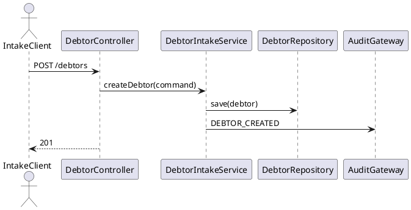
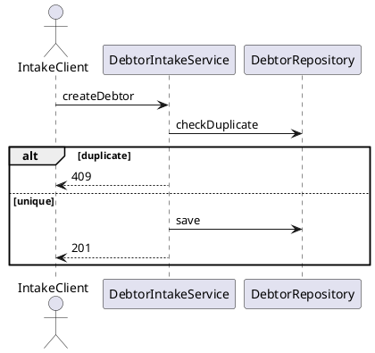
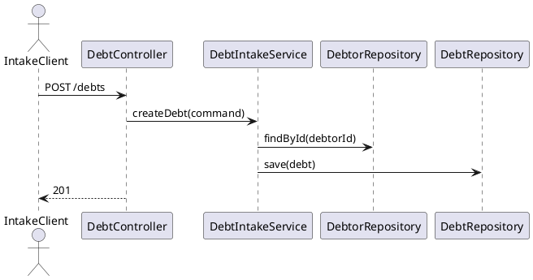
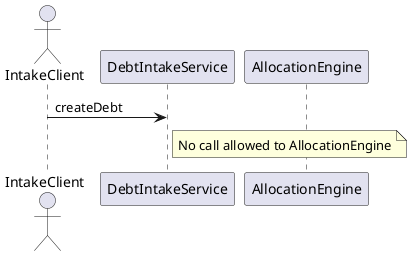
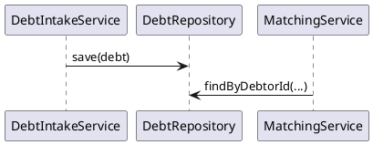
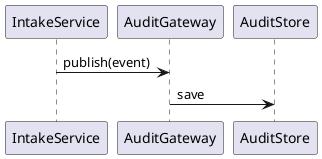

# Extension Analysis

**Trigger mode:** extension-business  
**SAD check:** with-sad  
**Date:** 2026-06-30  
**Author:** technical-functional-analyst

## 1. Trigger

### 1.1 Source

Authoritative new scope (inbox):
- `knowledge/inbox/confluence-list-page-id.md` (IDs: `7117963683`, `7116980899`). [source: knowledge/inbox/confluence-list-page-id.md]
- `confluence:7117963683` (new business epic for debtor/debt intake). [source: confluence:7117963683]
- `confluence:7116980899` (SAD v2 addendum including intake in scope). [source: confluence:7116980899]

Historical baseline:
- `knowledge/baseline/confluence-list-page-id.md` (IDs: `7078052229`, `7091912737`). [source: knowledge/baseline/confluence-list-page-id.md]
- `confluence:7078052229` (baseline payment allocation epic). [source: confluence:7078052229]
- `confluence:7091912737` (baseline SAD). [source: confluence:7091912737]
- `.opencode/plans/technical-analysis.md` and `.opencode/plans/architecture-plan.md`. [source: .opencode/plans/technical-analysis.md] [source: .opencode/plans/architecture-plan.md]

### 1.2 Summary

The extension adds upstream intake capabilities (debtor creation + debt creation + duplicate prevention + intake auditability) while preserving the existing payment-driven matching/allocation lifecycle and its strict safety rules. [source: confluence:7117963683] [source: confluence:7116980899] [source: confluence:7078052229]

### 1.3 Mode-switch recommendation

**Confirm extension-business**. Scope is additive and explicitly preserves allocation behavior; no primary behavior rewrite is requested. [source: confluence:7117963683] [source: confluence:7116980899]

## 2. New business scope

### 2.1 Epic

- **Epic:** Debtor and Debt Intake for Payment Allocation (Pre-Allocation Scope). [source: confluence:7117963683]
- **Business objective:** enable creation/maintenance of debtor and debt reference data before payment allocation.
- **Business value:** higher matching readiness, better data quality, full intake traceability.
- **Priority:** high.

### 2.2 Features

| Feature | Description | Priority |
|---|---|---|
| Debtor intake | Create debtor with mandatory/type-based validation and duplicate prevention | High |
| Debt intake | Create debt linked to existing debtor with positive amount and valid opening data | High |
| Decoupling guardrail | Intake must never trigger allocation | High |
| Intake auditability | Log intake request/outcome/duplicate/rejection events | High |

### 2.3 User stories

#### User Story [US-DI-001 — Create Debtor]
##### 1. Context and Objective
- Add debtor creation (person/enterprise) as upstream flow. [source: confluence:7117963683]
##### 2. Detailed Functional Specifications
- Validate mandatory fields per debtor type.
- Assign unique debtor UUID.
- Default status active unless policy override.
- No allocation/matching side effects.
##### 3. API Contract
- `POST /debtors` (new) with debtor identity payload.
- `GET /debtors/{id}` (new) for debtor detail retrieval.
- `GET /debtors` (new) for controlled debtor search/list.
- `201` on success, `400` invalid input, `409` duplicate.
- Audit: `DEBTOR_CREATION_REQUESTED`, `DEBTOR_CREATED`, `DEBTOR_CREATION_REJECTED`.
- Authorization: create/read endpoints require dedicated master-data access permissions (proposed: `DEBTOR_MASTER_WRITE`, `DEBTOR_MASTER_READ` — requires architect confirmation).
##### 4. Data Model
- Reuse `debtor` entity/table; add write path (currently query-focused repository API). [source: adapter-out/src/main/java/com/pipelinepro/adapter/out/persistence/entity/DebtorEntity.java]
##### 5. Business Rules and Validations
- BR-INTAKE-01 and FRQ-020/021/022 apply.
##### 6. Error Management
- Invalid payload -> business validation error.
- Duplicate -> conflict error.
##### 7. Edge Cases
- Same enterprise/national identifier submitted concurrently.
##### 8. Dependencies
- Domain port additions + persistence adapter write method + controller + mapper + bean wiring.
##### 9. Technical Acceptance Criteria
- WebMvc + service + DataJpa tests for create success/invalid/duplicate.
##### 10. UML Sequence Diagram

#### User Story [US-DI-002 — Prevent Invalid or Duplicate Debtor Registration]
##### 1. Context and Objective
- Block invalid/duplicate debtor records before persistence. [source: confluence:7117963683]
##### 2. Detailed Functional Specifications
- Validate identity rules.
- Check duplicate keys before create.
- On duplicate: block or route for review (policy-driven).
##### 3. API Contract
- `POST /debtors` same endpoint; duplicate produces `409`.
##### 4. Data Model
- Preserve unique constraints on `national_number_hash` and `enterprise_number`. [source: adapter-out/src/main/java/com/pipelinepro/adapter/out/persistence/entity/DebtorEntity.java]
##### 5. Business Rules and Validations
- BR-INTAKE-05 + FRQ-022.
##### 6. Error Management
- Duplicate detection logged as `DUPLICATE_DEBTOR_DETECTED`.
##### 7. Edge Cases
- Race condition on duplicate detection (must rely on DB uniqueness + error mapping).
##### 8. Dependencies
- Debtor repository duplicate lookups and conflict mapping.
##### 9. Technical Acceptance Criteria
- Parallel create tests ensure one succeeds, one conflicts.
##### 10. UML Sequence Diagram

#### User Story [US-DI-003 — Create Debt Linked to Existing Debtor]
##### 1. Context and Objective
- Add debt creation requiring an existing debtor. [source: confluence:7117963683]
##### 2. Detailed Functional Specifications
- Validate debtor exists.
- Validate amount > 0, debt reference rules, opening status policy, and valid currency according to business policy.
- Create debt linked by debtorId.
##### 3. API Contract
- `POST /debts` (new), `201`/`400`/`404`/`409`.
- Audit: `DEBT_CREATION_REQUESTED`, `DEBT_CREATED`, `DEBT_CREATION_REJECTED`.
- Authorization: debt create/read requires dedicated master-data access permissions (proposed: `DEBT_MASTER_WRITE`, `DEBT_MASTER_READ` — requires architect confirmation).
##### 4. Data Model
- Reuse `debt` table and uniqueness (`debtor_id`,`reference`). [source: adapter-out/src/main/java/com/pipelinepro/adapter/out/persistence/entity/DebtEntity.java]
##### 5. Business Rules and Validations
- BR-INTAKE-01/02 and FRQ-023/024/025.
##### 6. Error Management
- Unknown debtor -> not found/business rejection.
- Invalid currency -> business validation error (`400`).
##### 7. Edge Cases
- Concurrent duplicate debt reference for same debtor.
- Concurrent create with same debtor/reference must emit `DUPLICATE_DEBT_DETECTED` on conflict.
##### 8. Dependencies
- Debtor query port, debt write port, API mapping.
##### 9. Technical Acceptance Criteria
- Create debt happy path, unknown debtor, invalid amount, invalid currency, duplicate reference (+ duplicate-debt audit emission).
##### 10. UML Sequence Diagram

#### User Story [US-DI-004 — Debt Intake Does Not Trigger Allocation]
##### 1. Context and Objective
- Guarantee hard decoupling: intake is not an allocation trigger. [source: confluence:7117963683] [source: confluence:7116980899]
##### 2. Detailed Functional Specifications
- No call from debtor/debt intake services to matching/allocation use cases.
- Keep payment-driven entrypoint unchanged.
##### 3. API Contract
- No additional API; behavioral constraint on `POST /debtors` and `POST /debts`.
##### 4. Data Model
- No balance mutation from intake operations.
##### 5. Business Rules and Validations
- BR-INTAKE-03/04 and FRQ-026.
##### 6. Error Management
- If downstream allocation interaction is accidentally invoked, fail-fast and audit as technical incident.
##### 7. Edge Cases
- Asynchronous listeners or side effects must not auto-enqueue payment matching.
##### 8. Dependencies
- Bean wiring + architectural tests for forbidden coupling.
##### 9. Technical Acceptance Criteria
- Characterization tests proving no allocation records created after intake commands.
##### 10. UML Sequence Diagram

#### User Story [US-DI-005 — Make New Debt Available for Future Allocation Flow]
##### 1. Context and Objective
- Ensure eligible debt is visible to later payment matching flows. [source: confluence:7117963683]
##### 2. Detailed Functional Specifications
- Persist debt with status compatible with allocatable set.
- Existing read endpoint remains source for debt lookup.
##### 3. API Contract
- Preserve `GET /debtors/{debtorId}/debts` and `GET /debts/{debtId}` behavior.
##### 4. Data Model
- Reuse `debt.status` and debtor relation indexes. [source: adapter-out/src/main/java/com/pipelinepro/adapter/out/persistence/entity/DebtEntity.java]
##### 5. Business Rules and Validations
- Eligible status required for later matching use.
##### 6. Error Management
- Non-eligible status remains stored but excluded from allocatable views where required.
##### 7. Edge Cases
- Debt created in non-allocatable status then transitioned later.
##### 8. Dependencies
- Existing debt query application service preserved. [source: application/src/main/java/com/pipelinepro/application/QueryApplicationService.java]
##### 9. Technical Acceptance Criteria
- Query tests confirm visibility rules for eligible vs non-eligible statuses.
##### 10. UML Sequence Diagram

#### User Story [US-DI-006 — Audit Debtor and Debt Intake Lifecycle]
##### 1. Context and Objective
- Add mandatory intake audit coverage. [source: confluence:7117963683] [source: confluence:7116980899]
##### 2. Detailed Functional Specifications
- Emit request/success/rejection/duplicate events for debtor/debt intake.
- Mandatory duplicate events include both `DUPLICATE_DEBTOR_DETECTED` and `DUPLICATE_DEBT_DETECTED`.
##### 3. API Contract
- No dedicated API; audit side effects for intake commands.
##### 4. Data Model
- Reuse `audit_event` persistence and mapper/gateway paths. [source: adapter-out/src/main/java/com/pipelinepro/adapter/out/persistence/impl/JpaAuditEventGateway.java]
##### 5. Business Rules and Validations
- FRQ-027 mandatory auditability.
##### 6. Error Management
- Audit persistence failures handled per fail-safe policy (to confirm with architect).
##### 7. Edge Cases
- Duplicate submissions must still be auditable.
##### 8. Dependencies
- Existing `AuditEventGateway` integration from application services.
##### 9. Technical Acceptance Criteria
- Tests verify audit event emission for success/rejection and both duplicate-event types.
##### 10. UML Sequence Diagram

## 3. Integration points with the existing codebase

### 3.1 Modules

| Module | Why touched | Action (add file / edit existing for wiring) |
|---|---|---|
| domain | Add intake use cases/commands and outbound write ports | add files |
| application | Add debtor/debt intake application services | add files |
| adapter-in | Add `DebtorController`, request/response DTOs, mapper | add files |
| adapter-out | Add write methods/repositories/mapper support for debtor/debt create | edit existing for wiring + add files |
| bootstrap | Register new use-case beans | edit existing for wiring |

### 3.2 Classes and files

| Path | Action | What is added |
|---|---|---|
| `adapter-in/src/main/java/com/pipelinepro/adapter/in/web/v1/DebtController.java` | edit existing for wiring | optional create endpoints or keep read-only and create new `DebtorController` |
| `application/src/main/java/com/pipelinepro/application/QueryApplicationService.java` | preserve | read APIs unchanged for debt discoverability |
| `domain/src/main/java/com/pipelinepro/domain/port/out/DebtorRepository.java` | edit existing for wiring | `save(...)` and duplicate-check operations |
| `adapter-out/src/main/java/com/pipelinepro/adapter/out/persistence/impl/JpaDebtorRepository.java` | edit existing for wiring | implement create/save/duplicate checks |
| `adapter-out/src/main/java/com/pipelinepro/adapter/out/persistence/repository/SpringDataDebtorRepository.java` | edit existing for wiring | query helpers for duplicate policy |
| `bootstrap/src/main/java/com/pipelinepro/bootstrap/config/ApplicationServiceConfig.java` | edit existing for wiring | intake use-case bean registration |

### 3.3 Endpoints

| Existing controller path | New endpoints added | Notes |
|---|---|---|
| `/debtors/{debtorId}/debts`, `/debts/{debtId}` | `POST /debtors`, `GET /debtors/{id}`, `GET /debtors`, `POST /debts` | preserve existing debt GET contracts |
| `/payments/**`, `/allocation-proposals/**`, `/allocations/**` | none | preserved contract |

### 3.4 Persistence schema

| Existing table | New columns / indexes | Additive? (yes / no — if no, document the decision) |
|---|---|---|
| `debtor` | none required initially (reuse existing columns/constraints) | yes |
| `debt` | none required initially (reuse uniqueness/indexes) | yes |
| `audit_event` | no schema change | yes |

### 3.5 Configuration entries

| Configuration file | New entries | Rationale |
|---|---|---|
| `bootstrap/src/main/resources/application.yml` | optional duplicate-policy toggles | policy-controlled intake behavior |

## 4. Preserved contract

### 4.1 Preserved public APIs

| Method | Path | Request shape | Response shape | Status codes |
|---|---|---|---|---|
| POST | `/payments` | receive payment payload | payment summary | 201/400/409 |
| GET | `/payments/{paymentId}` | path id | payment details | 200/404 |
| GET | `/payments/{paymentId}/proposals` | path id | proposal list | 200/404 |
| POST | `/payments/{paymentId}/match` and subpaths | path id | match result/proposal result | 200/202/4xx |
| GET | `/allocation-proposals/{proposalId}` | path id | proposal detail | 200/404 |
| POST | `/allocation-proposals/{proposalId}/validate|reject|select-debt|mark-unmatched|request-investigation` | command payload | proposal/allocation state | 200/4xx |
| POST | `/allocations` | execute allocation payload | allocation result | 201/4xx |
| GET | `/allocations/{allocationId}` | path id | allocation detail | 200/404 |
| GET | `/debtors/{debtorId}/debts` | path + optional status | debt list | 200/404 |
| GET | `/debts/{debtId}` | path id | debt detail | 200/404 |

### 4.2 Preserved persistence schema entries

| Entry | Reason it must be preserved |
|---|---|
| `payment.uk_payment_bank_transaction_reference` | idempotent payment intake guarantee |
| `debtor.uk_debtor_national_number_hash` and `uk_debtor_enterprise_number` | duplicate prevention + identifier integrity |
| `debt.uk_debt_debtor_reference` | no duplicate debt reference for same debtor |
| `payment.version`, `debt.version` | optimistic concurrency control |

### 4.3 Preserved observable behaviors

| Behavior | Reason it must be preserved |
|---|---|
| Strict matching order structured -> identifier -> name | core business safety rule |
| Automatic allocation only for valid/unambiguous structured communication | baseline contract |
| Identifier/name matching requires manual proposal validation | baseline risk-control rule |
| Intake must not trigger allocation | new/explicit v2 boundary rule |

## 5. Migration considerations

- Data migration: **no** (reuse existing schema structures).
- API versioning: **no** (additive endpoints only).
- Frontend impact: **yes** (new intake screens/forms if exposed in UI).

Details:
- Backward-compatible additive extension; no destructive schema/API changes required.
- NFR additions from SAD v2 to enforce in implementation and tests: (1) intake idempotency where applicable, (2) deterministic/traceable intake validations, (3) intake throughput and observability independently monitorable from allocation workload. [source: confluence:7116980899]

## 6. Open questions

- What exact duplicate business keys (person vs enterprise) are mandatory for debtor create policy? [source: confluence:7117963683]
- Must duplicate candidates be blocked always, or routed to review workflow? [source: confluence:7117963683]
- Should intake audit failure block create operations (fail-safe) or allow eventual retry? [source: confluence:7116980899]
- Which initial debt statuses are considered allocatable by default in production policy? [source: confluence:7117963683]

## 7. Readiness

- Readiness level: **Ready with minor clarifications**
- Main blockers: duplicate-rule policy and audit-failure policy decisions.
- Recommended next actions:
  1. Confirm duplicate policy matrix and conflict handling.
  2. Confirm intake authorization roles (temporary proposed permission names: `DEBTOR_MASTER_WRITE`, `DEBTOR_MASTER_READ`, `DEBT_MASTER_WRITE`, `DEBT_MASTER_READ`).
  3. Freeze intake API payload contracts.
- Mode-switch recommendation: **Confirm extension-business**.
