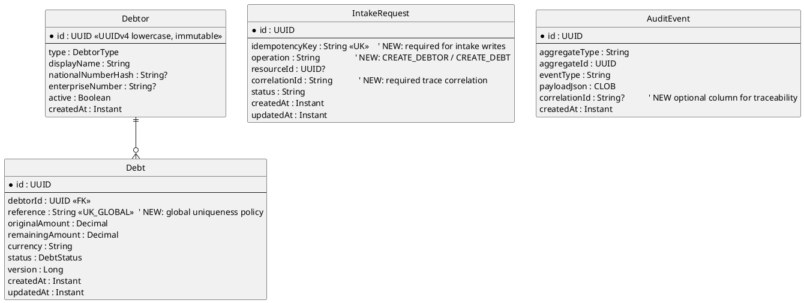
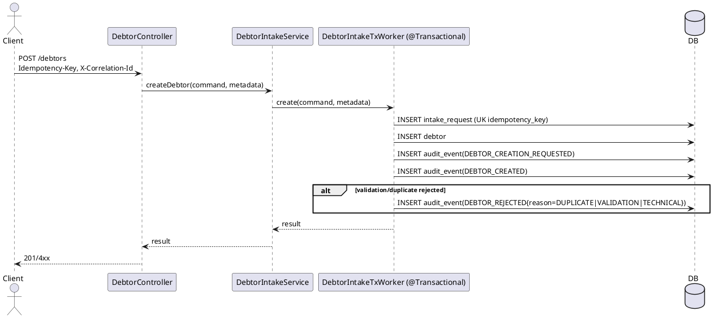
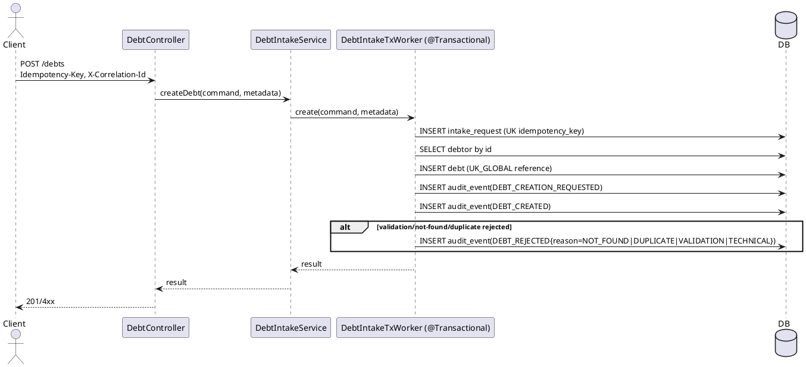

# Extension Plan

**Trigger mode:** extension-business
**SAD check:** with-sad
**Date:** 2026-06-30
**Author:** sad-architect-reviewer

## 1. Scope

Reference: `.opencode/plans/extension-analysis.md` (authoritative source of truth for this extension cycle).

This extension adds debtor/debt intake capabilities while preserving existing payment-allocation behavior. It also locks user-confirmed policy decisions:
- Debtor ID: UUID v4 canonical lowercase, server-generated, immutable.
- Debt reference: globally unique across all debtors.
- Mandatory intake audit lifecycle: `*_REQUESTED`, `*_CREATED`, `*_REJECTED`.
- Allocatable debt statuses: `OPEN`, `PARTIALLY_PAID` only.
- Allocation cancellation: out of scope.
- Intake controls: required idempotency key + required correlationId + mandatory metrics/logs/traces + SLO alerts.
- Permissions: `VIEW_DEBTOR_MASTER_DATA`, `CREATE_DEBTOR`, `VIEW_DEBT_MASTER_DATA`, `CREATE_DEBT`.

Policy resolution for previously open point:
- Audit persistence behavior for intake writes is **fail-safe blocking**: if mandatory audit event persistence fails, the intake transaction is rolled back and the API returns technical failure (no partial create).

Policy override note:
- Earlier analysis acceptance criteria mentioning dedicated duplicate events (`DUPLICATE_*`) are superseded in this cycle by the confirmed minimal lifecycle policy; duplicate outcomes are represented as `*_REJECTED` with reason code `DUPLICATE`.

New/extended artifacts:
- New endpoints: `POST /debtors`, `GET /debtors/{id}`, `GET /debtors`, `POST /debts`.
- New intake application/domain flows for debtor and debt creation.
- Minimal edits to existing files for repository wiring, security mapping, and bean registration.
- Schema deltas: intake idempotency persistence + debt reference global uniqueness rollout.

## 2. Preserved contract

### 2.1 Preserved public APIs

| Method | Path | Request shape | Response shape | Status codes |
|---|---|---|---|---|
| POST | `/payments` | receive payment payload | payment summary | 201/400/409 |
| GET | `/payments/{paymentId}` | path id | payment details | 200/404 |
| GET | `/payments/{paymentId}/proposals` | path id | proposal list | 200/404 |
| POST | `/payments/{paymentId}/match` and subpaths | path id | match/proposal result | 200/202/4xx |
| GET | `/allocation-proposals/{proposalId}` | path id | proposal detail | 200/404 |
| POST | `/allocation-proposals/{proposalId}/validate\|reject\|select-debt\|mark-unmatched\|request-investigation` | command payload | proposal/allocation state | 200/4xx |
| POST | `/allocations` | execute allocation payload | allocation result | 201/4xx |
| GET | `/allocations/{allocationId}` | path id | allocation detail | 200/404 |
| GET | `/debtors/{debtorId}/debts` | path + optional status | debt list | 200/404 |
| GET | `/debts/{debtId}` | path id | debt detail | 200/404 |

### 2.2 Preserved persistence schema entries

| Entry | Reason |
|---|---|
| `payment.uk_payment_bank_transaction_reference` | Preserve payment intake idempotency guarantee |
| `debtor.uk_debtor_national_number_hash`, `debtor.uk_debtor_enterprise_number` | Preserve debtor duplicate prevention |
| `payment.version`, `debt.version` | Preserve optimistic concurrency semantics |

Approved contract evolution (explicit):
- `debt.uk_debt_debtor_reference` is superseded by a global unique key on `debt.reference` (approved business policy decision for this cycle).

### 2.3 Preserved observable behaviors

| Behavior | Reason |
|---|---|
| Strict matching order: structured -> identifier -> name | Core allocation safety contract |
| Automatic allocation only for valid/unambiguous structured communication | Core risk-control contract |
| Identifier/name matching requires manual proposal validation | Core governance contract |
| Intake must not trigger allocation | Explicit SAD v2 boundary and extension invariant |

## 3. Data model after extension

## 4. REST API additions

| Method | Path | Request | Response | Status codes | Label (new / extended) |
|---|---|---|---|---|---|
| POST | `/debtors` | CreateDebtorRequest + required headers `Idempotency-Key`, `X-Correlation-Id` | DebtorResponse | 201, 400, 401, 403, 409 | new |
| GET | `/debtors/{id}` | path id | DebtorResponse | 200, 401, 403, 404 | new |
| GET | `/debtors` | search query | DebtorListResponse | 200, 401, 403 | new |
| POST | `/debts` | CreateDebtRequest + required headers `Idempotency-Key`, `X-Correlation-Id` | DebtResponse | 201, 400, 401, 403, 404, 409 | new |

Authorization mapping:
- Debtor read: `VIEW_DEBTOR_MASTER_DATA`
- Debtor create: `CREATE_DEBTOR`
- Debt read: `VIEW_DEBT_MASTER_DATA`
- Debt create: `CREATE_DEBT`

## 5. Locking strategy for new flows

| Operation | Lock type | Implementation | Rationale |
|---|---|---|---|
| Debtor intake idempotency | Unique-key based optimistic | `IntakeRequest.idempotency_key` unique + replay handling in adapter-out worker | Retry-safe create without coarse locks |
| Debtor duplicate prevention | Unique-key based optimistic | Existing debtor unique constraints + conflict mapping to 409 | Race-safe duplicate blocking |
| Debt intake idempotency | Unique-key based optimistic | Same `IntakeRequest` mechanism | Deterministic retry behavior |
| Debt reference global uniqueness | Unique-key based optimistic | DB unique key on `debt.reference` + conflict mapping to 409 | Enforce approved global reference policy under concurrency |
| Allocation flows | Unchanged | Existing pessimistic/optimistic strategy preserved | Non-regression of baseline behavior |

Transaction rule: `@Transactional` only in adapter-out transactional workers.

## 6. Sequence diagrams (PlantUML)

### 6.1 Debtor intake write flow

### 6.2 Debt intake write flow

## 7. Frontend additions

| Page | File | Status (new / extended) | Content |
|---|---|---|---|
| Debtor intake | `bootstrap/src/main/resources/static/debtors/create.html` | new | Debtor form with idempotency/correlation hints and validation errors |
| Debtor list/search | `bootstrap/src/main/resources/static/debtors/list.html` | new | Search/list debtor master data |
| Debt intake | `bootstrap/src/main/resources/static/debts/create.html` | new | Debt form with debtor selector and allowed opening statuses |
| Main navigation | existing shell page | extended | Add links to Debtor/Debt master-data pages only |

## 8. Implementation steps

| # | Layer | Step description | New files only? | Edits-existing (paths) | Subagent | How to verify | Non-regression check |
|---|---|---|---|---|---|---|---|
| 1 | domain | Add debtor/debt intake commands, inbound ports, outbound ports, and domain validation policies (UUID policy, allocatable statuses policy) | yes | — | domain-engineer | `mvn -q test -pl domain` | Run full existing domain tests |
| 2 | adapter-out | Add intake idempotency persistence (`IntakeRequest` entity/repo/gateway) and transactional workers for debtor/debt create | mostly yes | wiring in existing persistence config/repositories | persistence-engineer | `mvn -q test -pl adapter-out -Dtest='*Intake*Test,*Repository*Test'` | Existing adapter-out tests remain green |
| 3 | adapter-out | Implement global debt reference uniqueness migration and conflict mapping | no | `DebtEntity` + migration scripts + repository checks | persistence-engineer | `mvn -q test -pl adapter-out -Dtest='*Debt*Constraint*Test,*Concurrency*Test'` | Existing debt query/allocation persistence tests green |
| 4 | application | Add intake application services orchestrating ports and lifecycle audit emission (`*_REQUESTED/*_CREATED/*_REJECTED`) with duplicate mapped to `*_REJECTED` reason code | yes | — | domain-engineer | `mvn -q test -pl application` | Existing allocation service tests green |
| 5 | adapter-in | Add debtor/debt write endpoints + DTOs + header validation (`Idempotency-Key`, `X-Correlation-Id`) + permission checks | yes | optional extension of existing debt controller wiring | web-engineer | `mvn -q test -pl adapter-in -Dtest='*Debtor*Controller*Test,*Debt*Controller*Test,*Security*Test'` | Existing payment/proposal controller tests green |
| 6 | bootstrap | Register new beans, security permission mappings, and observability meters/traces/log correlation for intake | no | `ApplicationServiceConfig`, `application.yml`, security config | web-engineer | `mvn -q test -pl bootstrap -Dtest='*Context*Test,*Observability*Test'` | Existing bootstrap smoke tests green |
| 7 | frontend | Add intake/list pages and minimal navigation wiring | yes | existing navigation page only | frontend-engineer | `mvn -q test -pl bootstrap -Dtest='*UiSmoke*Test'` | Existing static page tests green |
| 8 | hardening | Add extension-focused concurrency, idempotency replay, decoupling (intake no allocation trigger), and SLO alert-rule tests/checks | no | test modules + monitoring config | test-engineer | `mvn -q test -pl adapter-out,bootstrap -Dtest='*Concurrency*Test,*Idempotency*Test,*Integration*Test'` | Full regression suite green |

## 9. Migration plan

### 9.1 Data migration

- Tooling: project migration mechanism (Flyway/Liquibase used by bootstrap).
- Forward script (additive + controlled evolution):
  1. Create `intake_request` table with unique `idempotency_key`.
  2. Add `audit_event.correlation_id` nullable column.
  3. Pre-check duplicates for `debt.reference` across all debtors.
  4. Drop `uk_debt_debtor_reference` and add global unique `uk_debt_reference_global` (explicit approved contract evolution).
- Backward script (rollback):
  1. Restore composite unique key.
  2. Keep `intake_request` table and `correlation_id` column (safe additive rollback posture).
- Backward-compatibility window: one release with pre-check report required before applying unique-key switch.

### 9.2 API versioning

- Existing endpoints preserved as-is: yes.
- New endpoints exposed at: `/debtors`, `/debts` under existing API versioning convention.
- Deprecation plan (if any): none in this cycle.

### 9.3 Frontend impact

- New pages: debtor intake/list, debt intake.
- Modified existing pages (for navigation only): shell/menu.
- Coordination notes: frontend must send required idempotency and correlation headers for intake writes.

## 10. Risks and mitigations

| Risk | Likelihood | Impact | Mitigation | Rollback trigger |
|---|---|---|---|---|
| Existing data violates global debt reference uniqueness | Medium | High | Pre-migration duplicate scan + remediation playbook | Any duplicate found at cutover |
| Retry storms create duplicate intake attempts | Medium | Medium | Enforce required idempotency key + deterministic replay response | Idempotency conflict/error rate above SLO |
| Intake accidentally triggers allocation | Low | High | Architectural/contract tests asserting no allocation side effects | Any intake test creates allocation/proposal records |
| Permission misconfiguration blocks authorized users | Medium | Medium | Explicit permission mapping tests with fixed names | Authz regression in smoke tests |
| Missing traceability/alerts on intake failures | Medium | Medium | CorrelationId propagation, metrics/traces/logs, SLO alert rules | Observability checks fail in hardening gate |

## 11. Approval

- [ ] User approval received before `/build extension` is executed.
