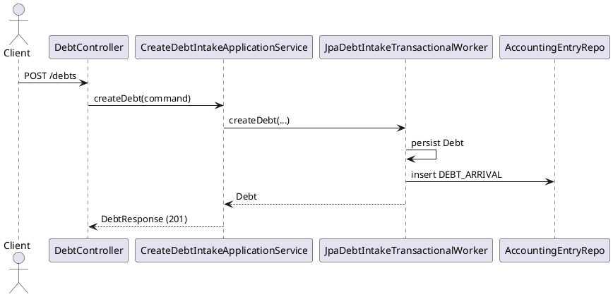
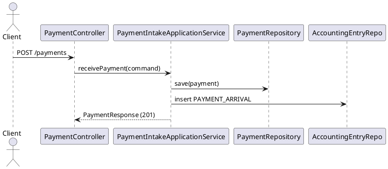
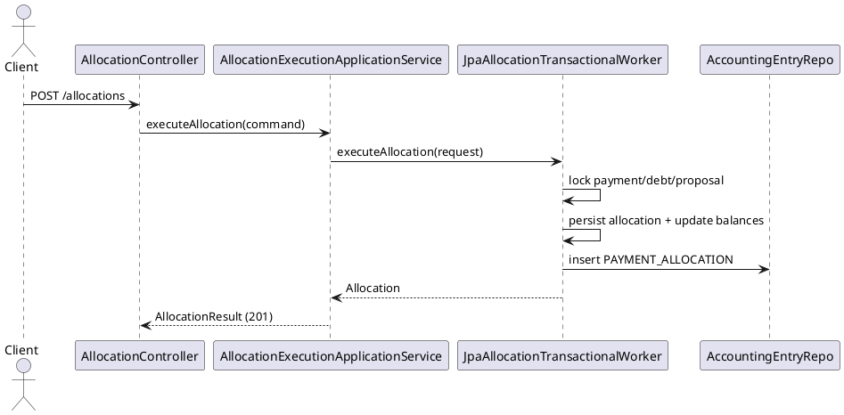
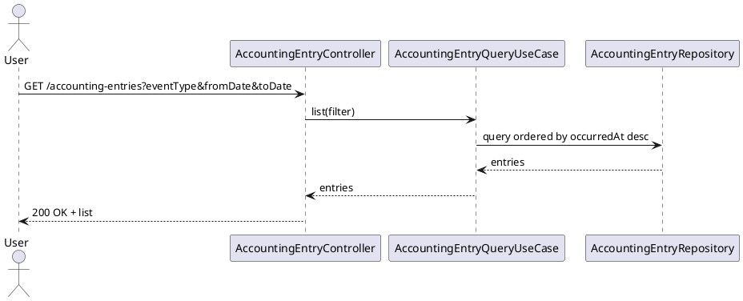

# Extension Analysis

**Trigger mode:** extension-business
**SAD check:** with-sad
**Date:** 2026-07-10
**Author:** technical-functional-analyst

## 1. Trigger

### 1.1 Source

Authoritative new scope files under `knowledge/inbox/`:
- `knowledge/inbox/confluence-list-page-id.md` (declares page IDs `7153680430`, `7153680541`)
- `confluence:7153680430` (Epic: Minimal Accounting Entries for Core Financial Events)
- `confluence:7153680541` (Addendum — SAD v3: Minimal Accounting Entries In Scope)

Historical context under `knowledge/baseline/`:
- `knowledge/baseline/v-1/confluence-list-page-id.md`
- `confluence:7078052229` (Payment allocation epic baseline)
- `confluence:7091912737` (SAD baseline)
- `knowledge/baseline/v-2/confluence-list-page-id.md`
- `confluence:7117963683` (Debtor/debt intake epic)
- `confluence:7116980899` (SAD v2 addendum)

### 1.2 Summary

The new scope adds a minimal immutable accounting trace as an additive capability: one new aggregate for accounting entries, automatic creation on three successful existing business events (debt creation, payment reception, allocation execution), and one read-only consultation capability with filters (`eventType`, `fromDate`, `toDate`) and newest-first order (source: `confluence:7153680430`, `confluence:7153680541`).

### 1.3 Mode-switch recommendation

**Confirm extension-business.**
Rationale: the inbox scope is additive (new aggregate + new read API/screen + side-effect wiring) and explicitly preserves existing allocation/matching rules without replacing current behavior (source: `confluence:7153680430`, `confluence:7153680541`).

## 2. New business scope

### 2.1 Epic

- **Title:** Minimal Accounting Entries for Core Financial Events
- **Business objective:** provide formal accounting traceability for core movements
- **Business value:** finance/audit visibility and traceability with low-complexity design
- **Priority:** high (auditability/compliance enabler)

### 2.2 Features

| Feature | Description | Priority |
|---|---|---|
| Accounting trace write side | Create immutable accounting entries on successful debt intake, payment intake, and allocation execution | High |
| Accounting consultation | Expose read-only listing endpoint and standalone UI with event/date filters | High |

### 2.3 User stories

#### User Story [US-ACC-001 — Create Entry on Debt Arrival]

##### 1. Context and Objective
When debt creation succeeds, persist one immutable accounting entry with `eventType=DEBT_ARRIVAL` (source: `confluence:7153680430`, `confluence:7153680541`).

##### 2. Detailed Functional Specifications
- Trigger only after successful debt creation.
- Entry mandatory fields: event type, source aggregate type/id, amount, currency, occurredAt.
- No entry on rejected debt creation.

##### 3. API Contract
- No new write API.
- Existing `POST /debts` behavior preserved; adds internal side effect only (`adapter-in/.../DebtController.java`).

##### 4. Data Model
- New table/aggregate `accounting_entry` (append-only).
- Row includes: `id`, `event_type`, `source_aggregate_type`, `source_aggregate_id`, `amount`, `currency`, `occurred_at`, `created_at`.

##### 5. Business Rules and Validations
- BR-ACC-01, BR-ACC-03, BR-ACC-04 apply.
- `amount > 0`, non-null mandatory fields.

##### 6. Error Management
- If accounting insert fails, operation should fail and rollback the debt transaction (architectural intent from same-transaction requirement; source: `confluence:7153680430`).

##### 7. Edge Cases
- Duplicate debt create retries via idempotency must not duplicate accounting entries.
- Replayed successful idempotent request should return existing debt and not create extra accounting record.

##### 8. Dependencies
- Debt intake worker and idempotency flow (`adapter-out/.../JpaDebtIntakeTransactionalWorker.java`).

##### 9. Technical Acceptance Criteria
- Test: successful create debt -> exactly 1 `DEBT_ARRIVAL` entry.
- Test: rejected create debt -> 0 new entry.
- Test: idempotent replay -> still exactly 1 entry.

##### 10. UML Sequence Diagram

#### User Story [US-ACC-002 — Create Entry on Payment Arrival]

##### 1. Context and Objective
When payment reception succeeds, persist one immutable accounting entry with `eventType=PAYMENT_ARRIVAL` (source: `confluence:7153680430`, `confluence:7153680541`).

##### 2. Detailed Functional Specifications
- Trigger after successful payment persistence.
- No entry when payment reception fails/rejected.

##### 3. API Contract
- Existing `POST /payments` response contract preserved (`adapter-in/.../PaymentController.java`).

##### 4. Data Model
- Reuse `accounting_entry` with `source_aggregate_type=PAYMENT`.

##### 5. Business Rules and Validations
- One successful event => exactly one entry.

##### 6. Error Management
- Accounting write failure should rollback payment intake transaction.

##### 7. Edge Cases
- Duplicate `bankTransactionReference` rejection must create no accounting entry.

##### 8. Dependencies
- Payment intake service flow (`application/.../PaymentIntakeApplicationService.java`), payment repository (`adapter-out/.../JpaPaymentRepository.java`).

##### 9. Technical Acceptance Criteria
- Test: successful intake -> 1 `PAYMENT_ARRIVAL` entry.
- Test: duplicate payment rejected -> 0 new `PAYMENT_ARRIVAL` entry.

##### 10. UML Sequence Diagram

#### User Story [US-ACC-003 — Create Entry on Payment Allocation]

##### 1. Context and Objective
When allocation execution succeeds, persist one immutable accounting entry with `eventType=PAYMENT_ALLOCATION` (source: `confluence:7153680430`, `confluence:7153680541`).

##### 2. Detailed Functional Specifications
- Trigger in allocation transactional boundary.
- No entry if allocation fails/rolls back.

##### 3. API Contract
- Existing `POST /allocations` and proposal-validation flows remain unchanged (`adapter-in/.../AllocationController.java`, `adapter-in/.../AllocationProposalController.java`).

##### 4. Data Model
- Reuse `accounting_entry` with `source_aggregate_type=ALLOCATION` and `source_aggregate_id=allocationId`.

##### 5. Business Rules and Validations
- Entry created only after successful allocation domain execution.

##### 6. Error Management
- Entry insert failure must rollback allocation transaction.

##### 7. Edge Cases
- Idempotent allocation replay must not duplicate accounting entry.

##### 8. Dependencies
- `adapter-out/.../JpaAllocationTransactionalWorker.java` (current transaction + idempotency lock path).

##### 9. Technical Acceptance Criteria
- Test: successful allocation -> one `PAYMENT_ALLOCATION` entry.
- Test: replay same idempotency key -> no additional entry.

##### 10. UML Sequence Diagram

#### User Story [US-ACC-004 — Consult Accounting Entries]

##### 1. Context and Objective
Expose read-only consultation (API + standalone screen) with filters `eventType`, `fromDate`, `toDate`; default order newest-first by `occurredAt DESC` (source: `confluence:7153680430`, `confluence:7153680541`).

##### 2. Detailed Functional Specifications
- New workspace/screen “Accounting Entries”.
- Read-only list with empty-result behavior.
- No create/update/delete from UI.

##### 3. API Contract
- **New endpoint:** `GET /accounting-entries`
  - Query params: `eventType` (optional), `fromDate` (optional), `toDate` (optional)
  - Response: list ordered by `occurredAt DESC`
  - Security: role-restricted finance/audit access.

##### 4. Data Model
- Query from `accounting_entry`; indexes needed on `occurred_at`, `event_type`, and optionally composite `(event_type, occurred_at)`.

##### 5. Business Rules and Validations
- Read-only immutable trace.
- Date range validity (`fromDate <= toDate`).

##### 6. Error Management
- Invalid query parameters -> `400`.
- Unauthorized access -> `403`.

##### 7. Edge Cases
- Empty result returns `200` with empty list.
- Large periods require pagination decision (open question).

##### 8. Dependencies
- New controller/DTO/mapper in adapter-in.
- New query port/service in application/domain.
- New JPA repository in adapter-out.
- UI updates in static assets (`bootstrap/src/main/resources/static/index.html`).

##### 9. Technical Acceptance Criteria
- Test: default ordering desc by occurredAt.
- Test: eventType/date filters.
- Test: empty list behavior.
- Test: security denied for unauthorized role.

##### 10. UML Sequence Diagram

## 3. Integration points with the existing codebase

### 3.1 Modules

| Module | Why touched | Action (add file / edit existing for wiring) |
|---|---|---|
| domain | New accounting aggregate and query/write ports | add file |
| application | Orchestrate accounting write/query use cases | add file + minimal wiring edits |
| adapter-out | Persist/query accounting entries in JPA | add file + worker wiring edits |
| adapter-in | Expose read API `/accounting-entries` | add file |
| bootstrap | Register new beans | edit existing for wiring |
| static frontend | Add standalone read screen/navigation | add file + minimal link edit |

### 3.2 Classes and files

| Path | Action | What is added |
|---|---|---|
| `application/src/main/java/com/pipelinepro/application/PaymentIntakeApplicationService.java` | edit existing for wiring | call accounting-entry creation on successful payment intake |
| `application/src/main/java/com/pipelinepro/application/CreateDebtIntakeApplicationService.java` | edit existing for wiring (or delegate to worker) | trigger debt-arrival accounting entry within success flow |
| `adapter-out/src/main/java/com/pipelinepro/adapter/out/persistence/impl/JpaAllocationTransactionalWorker.java` | edit existing for wiring | persist `PAYMENT_ALLOCATION` accounting entry in same transaction |
| `bootstrap/src/main/java/com/pipelinepro/bootstrap/config/ApplicationServiceConfig.java` | edit existing for wiring | beans for accounting write/query services |
| `adapter-in/src/main/java/com/pipelinepro/adapter/in/web/v1/PaymentController.java` | preserve | no contract changes |
| `adapter-in/src/main/java/com/pipelinepro/adapter/in/web/v1/DebtController.java` | preserve | no contract changes |
| `adapter-in/src/main/java/com/pipelinepro/adapter/in/web/v1/AllocationController.java` | preserve | no contract changes |
| `bootstrap/src/main/resources/static/index.html` | edit existing for wiring | add link to accounting entries screen |

### 3.3 Endpoints

| Existing controller path | New endpoints added | Notes |
|---|---|---|
| `adapter-in/.../PaymentController.java` (`/payments`) | none | preserve contract |
| `adapter-in/.../DebtController.java` (`/debts`) | none | preserve contract |
| `adapter-in/.../AllocationController.java` (`/allocations`) | none | preserve contract |
| new controller | `GET /accounting-entries` | read-only consultation with filters |

### 3.4 Persistence schema

| Existing table | New columns / indexes | Additive? (yes / no — if no, document the decision) |
|---|---|---|
| `payment` | none | yes |
| `debt` | none | yes |
| `payment_allocation` | none | yes |
| `audit_event` | none | yes |
| **new `accounting_entry` table** | indexes on `occurred_at`, `event_type`, optional `(event_type, occurred_at)` | yes |

### 3.5 Configuration entries

| Configuration file | New entries | Rationale |
|---|---|---|
| `bootstrap/src/main/resources/application.yml` | optional pagination defaults for accounting listing | control payload size |
| security annotations/config | finance/audit authority for listing endpoint | role restriction requested by SAD addendum (`confluence:7153680541`) |

## 4. Preserved contract

### 4.1 Preserved public APIs

| Method | Path | Request shape | Response shape | Status codes |
|---|---|---|---|---|
| POST | `/payments` | unchanged (`ReceivePaymentRequest`) | unchanged (`PaymentResponse`) | unchanged |
| GET | `/payments/{paymentId}` | unchanged | unchanged (`PaymentDetailsResponse`) | unchanged |
| GET | `/payments/{paymentId}/proposals` | unchanged | unchanged | unchanged |
| POST | `/payments/{paymentId}/match` (+ subpaths) | unchanged | unchanged | unchanged |
| POST | `/debts` | unchanged + existing required headers | unchanged (`DebtResponse`) | unchanged |
| GET | `/debts/{debtId}` | unchanged | unchanged | unchanged |
| GET | `/debtors/{debtorId}/debts` | unchanged | unchanged | unchanged |
| POST | `/allocations` | unchanged | unchanged | unchanged |
| GET | `/allocations/{allocationId}` | unchanged | unchanged | unchanged |
| allocation-proposal lifecycle endpoints | unchanged | unchanged | unchanged | unchanged |

### 4.2 Preserved persistence schema entries

| Entry | Reason it must be preserved |
|---|---|
| `payment.uk_payment_bank_transaction_reference` | existing idempotency contract |
| `payment_allocation.uk_payment_allocation_idempotency_key` | replay safety |
| `payment_allocation.uk_payment_allocation_payment_debt_command` | duplicate prevention |
| `debt.uk_debt_reference_global` | debt uniqueness contract |
| optimistic versions on `payment`, `debt`, `allocation_proposal` | concurrency guarantees |

### 4.3 Preserved observable behaviors

| Behavior | Reason it must be preserved |
|---|---|
| Structured communication is the only automatic allocation path | baseline rule from SAD/BA (`confluence:7091912737`, `confluence:7153680541`) |
| Identifier/name matching remain proposal-only | non-regression functional contract |
| Allocation remains atomic with lock-based worker | correctness under concurrency (`adapter-out/.../JpaAllocationTransactionalWorker.java`) |
| Existing audit events remain emitted | compliance and trace continuity |

## 5. Migration considerations

- Data migration: **yes (additive schema only)**
- API versioning: **no** (new endpoint additive)
- Frontend impact: **yes** (new read-only screen + navigation entry)

Details:
- Additive DB migration introducing `accounting_entry` with non-breaking indexes.
- No destructive changes to existing tables/endpoints.
- Backfill is not required by current scope; entries start from go-live forward.

## 6. Open questions

- Should accounting-entry creation be **strictly blocking** (rollback business transaction on failure) for all three events? (architect)
- For `PAYMENT_ARRIVAL`, should `occurredAt` use bank execution/value date or technical reception timestamp? (business/architect)
- Do we require pagination on `GET /accounting-entries` now, or can MVP return bounded list only? (business/architect)
- Which exact authority names should protect accounting consultation (`FINANCE_READ`, `AUDIT_READ`, etc.)? (security)
- Is export (CSV/Excel) explicitly out of scope for this increment? (business)

## 7. Readiness

- Readiness level: **Ready with minor clarifications**
- Main blockers:
  - final authority naming and access policy for accounting consultation
  - timestamp policy for `occurredAt` on payment-arrival event
  - explicit transactional failure policy for accounting side-effect failures
- Recommended next actions:
  1. validate open questions with architect/security/business
  2. confirm additive migration script shape
  3. proceed to `/plan extension-business with-sad`
- Mode-switch recommendation: **Confirm extension-business**
