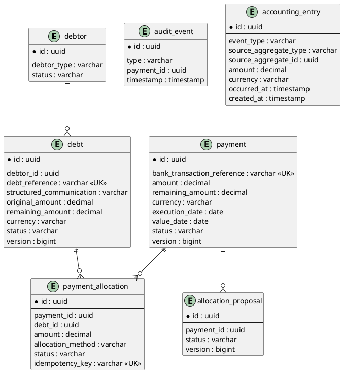
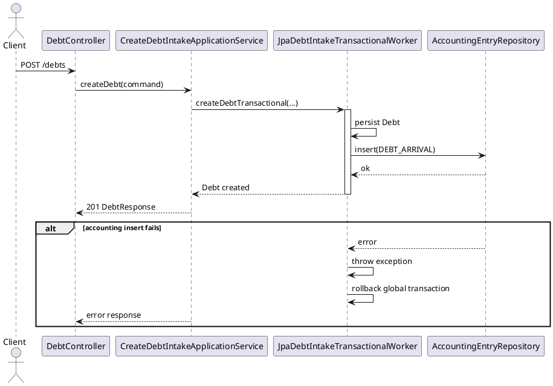
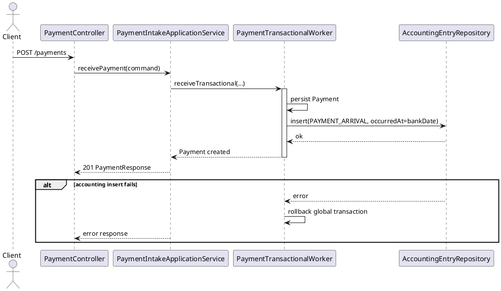
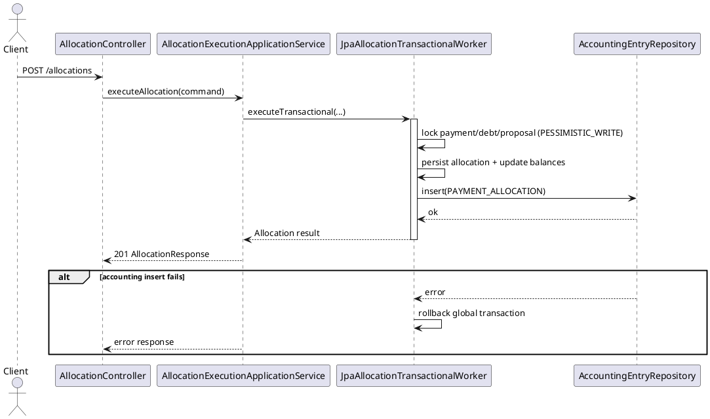

# Extension Plan

**Trigger mode:** extension-business
**SAD check:** with-sad
**Date:** 2026-07-10
**Author:** sad-architect-reviewer

## 1. Scope

Reference: `.opencode/plans/extension-analysis.md`.

This extension adds a minimal accounting trace capability without changing existing allocation, matching, proposal, and intake contracts.

Summary:
- **New module artifacts** across all hexagonal layers for `AccountingEntry` write/read capabilities.
- **New aggregate/table:** `accounting_entry` (append-only).
- **New endpoint:** `GET /accounting-entries` (read-only, bounded list for MVP).
- **New frontend page:** accounting entries consultation page + navigation link.
- **Existing files touched only for wiring/side-effects** on successful `POST /debts`, `POST /payments`, and `POST /allocations` flows.

Locked scope decisions for this increment:
- Accounting-entry write failure is **strictly blocking** with **global rollback**.
- `PAYMENT_ARRIVAL.occurredAt` source is **bank date**.
- Pagination for `GET /accounting-entries` is **not required for MVP** (bounded list).
- Authorization for accounting read access: **`ACCOUNTING_READ`**.
- CSV/Excel export is **explicitly out of scope**.

## 2. Preserved contract

(Copied from extension-analysis.md, synchronized.)

### 2.1 Preserved public APIs

| Method | Path | Request shape | Response shape | Status codes |
|---|---|---|---|---|
| POST | `/payments` | unchanged (`ReceivePaymentRequest`) | unchanged (`PaymentResponse`) | unchanged |
| GET | `/payments/{paymentId}` | unchanged | unchanged (`PaymentDetailsResponse`) | unchanged |
| GET | `/payments/{paymentId}/proposals` | unchanged | unchanged | unchanged |
| POST | `/payments/{paymentId}/match` (+ subpaths) | unchanged | unchanged | unchanged |
| POST | `/debts` | unchanged + existing required headers | unchanged (`DebtResponse`) | unchanged |
| GET | `/debts/{debtId}` | unchanged | unchanged | unchanged |
| GET | `/debtors/{debtorId}/debts` | unchanged | unchanged | unchanged |
| POST | `/allocations` | unchanged | unchanged | unchanged |
| GET | `/allocations/{allocationId}` | unchanged | unchanged | unchanged |
| allocation-proposal lifecycle endpoints | unchanged | unchanged | unchanged | unchanged |

### 2.2 Preserved persistence schema entries

| Entry | Reason |
|---|---|
| `payment.uk_payment_bank_transaction_reference` | existing idempotency contract |
| `payment_allocation.uk_payment_allocation_idempotency_key` | replay safety |
| `payment_allocation.uk_payment_allocation_payment_debt_command` | duplicate prevention |
| `debt.uk_debt_reference_global` | debt uniqueness contract |
| optimistic versions on `payment`, `debt`, `allocation_proposal` | concurrency guarantees |

### 2.3 Preserved observable behaviors

| Behavior | Reason |
|---|---|
| Structured communication is the only automatic allocation path | baseline SAD rule |
| Identifier/name matching remain proposal-only | non-regression functional contract |
| Allocation remains atomic with lock-based worker | concurrency/correctness contract |
| Existing audit events remain emitted | compliance and trace continuity |

## 3. Data model after extension

## 4. REST API additions

| Method | Path | Request | Response | Status codes | Label (new / extended) |
|---|---|---|---|---|---|
| GET | `/accounting-entries` | Query params: `eventType?`, `fromDate?`, `toDate?` (`fromDate <= toDate`) | `200` list of accounting entries sorted by `occurredAt DESC` (bounded list, no MVP pagination) | `200`, `400`, `403` | new |

Notes:
- Existing write APIs are unchanged externally; they gain internal side-effects only:
  - `POST /debts` => create `DEBT_ARRIVAL`
  - `POST /payments` => create `PAYMENT_ARRIVAL` (occurredAt = bank date)
  - `POST /allocations` => create `PAYMENT_ALLOCATION`

## 5. Locking strategy for new flows

| Operation | Lock type | Implementation | Rationale |
|---|---|---|---|
| Create `DEBT_ARRIVAL` accounting entry after debt creation | Same transaction as debt intake; rely on existing uniqueness/transaction semantics | Append accounting insert in debt transactional worker/service success path; on insert failure throw and rollback | Strict blocking policy guarantees no debt success without accounting trace |
| Create `PAYMENT_ARRIVAL` accounting entry after payment reception | Same transaction as payment intake; uniqueness via existing payment idempotency | Append accounting insert after payment persistence success; on failure rollback | Preserves exactly-once per successful payment while preventing orphan payment success |
| Create `PAYMENT_ALLOCATION` accounting entry after allocation execution | Reuse existing pessimistic locking path for allocation (`PESSIMISTIC_WRITE`) + same transaction insert | Insert accounting entry inside `JpaAllocationTransactionalWorker` after successful allocation state changes; rollback on failure | Maintains concurrency safety and strict consistency with allocation result |
| Read accounting entries (`GET /accounting-entries`) | No write lock; read path with indexed filtering | JPA query using indexes on `occurred_at`, `event_type` (optional composite `(event_type, occurred_at)`) | Efficient read-only consultation without contention |

## 6. Sequence diagrams (PlantUML)

For each new write flow, locking/transaction boundary is explicit and accounting write is strictly blocking.

### 6.1 Debt arrival -> DEBT_ARRIVAL

### 6.2 Payment arrival -> PAYMENT_ARRIVAL (occurredAt = bank date)

### 6.3 Allocation execution -> PAYMENT_ALLOCATION

## 7. Frontend additions

| Page | File | Status (new / extended) | Content |
|---|---|---|---|
| Accounting Entries | `bootstrap/src/main/resources/static/accounting-entries.html` | new | Read-only table: event type, source aggregate, source id, amount, currency, occurredAt; filters by event type and date range; newest-first display |
| Accounting Entries JS | `bootstrap/src/main/resources/static/js/accounting-entries.js` | new | Calls `GET /accounting-entries`, renders bounded list, handles empty state and filter validation |
| Main navigation | `bootstrap/src/main/resources/static/index.html` | extended | Add link/entry to Accounting Entries page |

Constraint: CSV/Excel export is out of scope for this increment.

## 8. Implementation steps

| # | Layer | Step description | New files only? | Edits-existing (paths) | Subagent | How to verify | Non-regression check |
|---|---|---|---|---|---|---|---|
| 1 | domain | Add `AccountingEntry` domain model + value objects/enums (`AccountingEventType`, `SourceAggregateType`) with immutability/guards | yes | none | domain-engineer | Unit tests for invariants and construction | Existing domain tests remain green |
| 2 | domain | Add outbound/inbound ports for accounting write/read (`AccountingEntryRepository`, `AccountingEntryQueryUseCase`) | yes | none | domain-engineer | Port contract tests | Existing domain contracts unchanged |
| 3 | adapter-out | Add JPA entity, Spring Data repository, mapper, and repository implementation for accounting entry persistence/query | yes | none | persistence-engineer | `@DataJpaTest` for insert/query/order/filter + index-aware query paths | Existing adapter-out repository tests green |
| 4 | adapter-out | Wire strict-blocking insert into debt intake transactional worker path | no | `adapter-out/.../JpaDebtIntakeTransactionalWorker.java` | persistence-engineer | Test success => one `DEBT_ARRIVAL`; insert failure => full rollback | Existing debt intake behavior unchanged |
| 5 | adapter-out | Wire strict-blocking insert into allocation transactional worker path | no | `adapter-out/.../JpaAllocationTransactionalWorker.java` | persistence-engineer | Concurrency/transaction tests: one `PAYMENT_ALLOCATION` per success; rollback on accounting failure | Existing allocation lock/idempotency tests green |
| 6 | application | Add accounting write service + read query service and orchestrate filters/validation (`fromDate <= toDate`) | yes | none | domain-engineer | JUnit/Mockito tests for orchestration and validation | Existing application service tests green |
| 7 | application | Wire payment intake path to create `PAYMENT_ARRIVAL` with `occurredAt` from bank date | no | `application/.../PaymentIntakeApplicationService.java` (or delegated worker wiring) | domain-engineer | Test `occurredAt=bankDate`; rejection -> no entry | Existing payment intake contract tests green |
| 8 | adapter-in | Add `GET /accounting-entries` controller + DTOs + mapper + validation + authority `ACCOUNTING_READ` | yes | none | web-engineer | `@WebMvcTest`: 200/400/403, sort/filter, empty list | Existing controller tests unchanged |
| 9 | bootstrap | Register beans and security mapping for accounting read path | no | `bootstrap/.../ApplicationServiceConfig.java`, security config | web-engineer | Bootstrap wiring tests/startup checks | Existing bean graph unaffected |
| 10 | frontend | Add standalone accounting entries page and JS; add navigation link from index | partly | `bootstrap/src/main/resources/static/index.html` | frontend-engineer | Manual UI check + endpoint integration in browser | Existing pages still functional |
| 11 | hardening | Add/extend transactional and idempotency tests for all 3 accounting triggers and strict rollback semantics | no | test files in adapter-out/application modules | test-engineer | Run module test suites once per impacted layer | Pre-existing full suite for impacted modules green |

## 9. Migration plan

### 9.1 Data migration

- Tooling: project migration mechanism (Flyway/Liquibase as already used in bootstrap/adapter-out).
- Forward script (additive):
  - create table `accounting_entry`;
  - add constraints: non-null mandatory fields, `amount > 0`;
  - add indexes: `idx_accounting_entry_occurred_at`, `idx_accounting_entry_event_type`, optional `idx_accounting_entry_event_type_occurred_at`.
- Backward script (rollback): drop `accounting_entry` table and related indexes (only for pre-production rollback windows).
- Backward-compatibility window: fully backward-compatible additive deployment; no changes required for existing API clients.

### 9.2 API versioning

- Existing endpoints preserved as-is: **yes**.
- New endpoints exposed at: `GET /accounting-entries`.
- Deprecation plan (if any): none in this increment.

### 9.3 Frontend impact

- New pages: `accounting-entries.html` (+ JS module).
- Modified existing pages (for navigation only): `index.html`.
- Coordination notes: ensure `ACCOUNTING_READ` users can access the page and endpoint; no export actions in UI.

## 10. Risks and mitigations

| Risk | Likelihood | Impact | Mitigation | Rollback trigger |
|---|---|---|---|---|
| Accounting side-effect breaks existing intake/allocation success paths | Medium | High | TDD for each trigger path + strict transactional tests before merge | Any regression on existing intake/allocation tests |
| Duplicate accounting entries under retries/idempotency replay | Medium | High | Reuse existing idempotency boundaries and assert exactly-once in integration tests | More than one entry for same successful business event |
| Read endpoint performance degradation on large date ranges | Low (MVP bounded list) | Medium | Indexed query + bounded list + validate filters | p95 latency exceeds agreed threshold in test env |
| Authorization misconfiguration exposes accounting data | Medium | High | Enforce `ACCOUNTING_READ` at controller/security config + `403` tests | Unauthorized access returns non-403 |
| Inconsistent `occurredAt` semantics for payment entries | Low | Medium | Lock rule now: `PAYMENT_ARRIVAL.occurredAt = bank date`; assert in tests | Any persisted entry not using bank date |

## 11. Approval

- [ ] User approval received before `/build extension` is executed.
