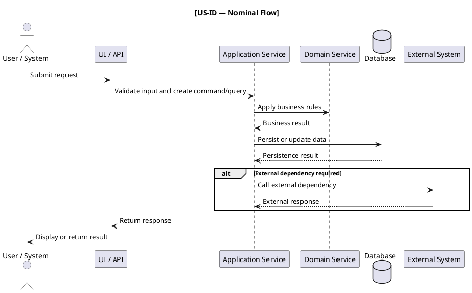
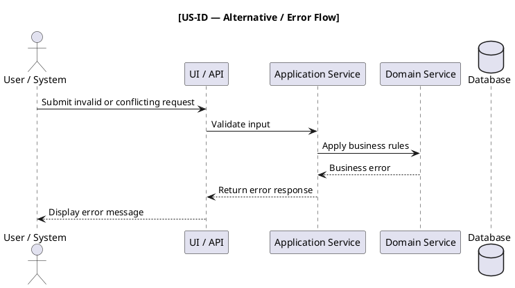

# Functional and Technical Analysis

## Epic: [Epic Title]

### Feature: [Feature Name]

#### User Story: [US-ID — Title]

##### 1. Context and Objective

**User Story Reference**

- ID:
- Title:
- Priority:
- As a:
- I want:
- So that:

**Technical Objective**

[Describe precisely what must be implemented technically, including architecture, persistence, security, integration, and operational aspects when relevant.]

**Technical Prerequisites**

- [Required component, service, configuration, role, permission, or dependency 1]
- [Required component, service, configuration, role, permission, or dependency 2]

**Source References**

- Business analysis reference:
- SAD reference:
- Complementary context:

---

##### 2. Detailed Functional Specifications

**2.1 User / System Flow**

Step 1: [Describe the trigger or initial action]  
↓  
Step 2: [Describe the functional or technical processing]  
↓  
Step 3: [Describe the next processing step]  
↓  
Step N: [Describe the final processing step]  
↓  
Success: [Describe the expected final state, status, response, or navigation]

**2.2 Screen / Interface Specification**

[Screen or interface name]

If no user interface is required, write:

`No user interface is required for this user story.`

**UI Components**

- [Component 1]: [Description, behavior, visibility rules, data source, and constraints]
- [Component 2]: [Description, behavior, visibility rules, data source, and constraints]
- [Component N]: [Description, behavior, visibility rules, data source, and constraints]

**Displayed Data**

| Field | Source | Masked? | Editable? | Comment |
|---|---|---:|---:|---|
| [Field name] | [Source object] | Yes/No | Yes/No | [Comment] |

**User Actions**

| Action | Trigger | Preconditions | Expected Result |
|---|---|---|---|
| [Action name] | [Button / event / API call] | [Conditions] | [Result] |

**Rules**

- [Validation or behavior rule 1]
- [Validation or behavior rule 2]
- [Triggered action and navigation if applicable]
- [Authorization-dependent behavior if applicable]
- [Audit behavior if applicable]

**Validation Rules**

| Field | Type | Mandatory | Format | Length | Validation |
|---|---|---:|---|---|---|
| [Field name] | [Type] | Yes/No | [Format] | [Min-Max] | [Regex, algorithm, or business rule] |
| [Field name] | [Type] | Yes/No | [Format] | [Min-Max] | [Regex, algorithm, or business rule] |

**Real-Time Validation**

- [Validation mechanism 1]
- [Validation mechanism 2]
- [Visual indicators and error messages]
- [Backend validation fallback if applicable]

**Draft / State Management**

- Trigger:
- Storage:
- Storage key:
- Expiration:
- Restoration:
- Cleanup rule:

---

##### 3. API Contract

If no API endpoint is required, write:

`No API endpoint is required for this user story.`

**3.1 Endpoint: [Purpose of the endpoint]**

`METHOD /path/to/resource`

**Endpoint Responsibility**

[Describe what the endpoint does and what business capability it supports.]

**Headers**

- Content-Type: [application/json or other] — mandatory/optional
- Authorization: [Bearer token / service token / other] — mandatory/optional
- X-Correlation-Id: [string] — mandatory/optional
- X-Idempotency-Key: [string] — mandatory/optional
- [Additional header]: [value] — mandatory/optional

**Path Parameters**

- [parameterName] — mandatory: [Description]

**Query Parameters**

- [parameterName] — mandatory/optional: [Description]
- [parameterName] — mandatory/optional: [Description]

**Request Body**

```json
{
  "field1": "value",
  "field2": "value | null",
  "nestedObject": {
    "subField1": "value",
    "subField2": "value"
  }
}
```

**Request Body Constraints**

- field1:
    - Type:
    - Mandatory:
    - Format:
    - Validation:
- field2:
    - Type:
    - Mandatory:
    - Nullable:
    - Validation:
- nestedObject.subField1:
    - Type:
    - Mandatory:
    - Validation:

**Response Codes**

- 200: [Successful processing]
- 201: [Resource created]
- 202: [Accepted for asynchronous processing]
- 204: [Successful processing without response body]
- 400: [Invalid request]
- 401: [Authentication required or invalid]
- 403: [Forbidden action]
- 404: [Resource not found]
- 409: [Conflict, duplicate, concurrency issue, or invalid state]
- 422: [Business validation failed]
- 500: [Technical error]

**Success Response**

```json
{
  "field1": "value",
  "field2": "value",
  "nestedObject": {
    "subField": "value"
  }
}
```

**Error Response**

```json
{
  "error": "ERROR_CODE",
  "message": "User-readable error message",
  "details": {
    "field": "additional information"
  }
}
```

**Idempotency**

- Idempotency key:
- Duplicate request behavior:
- Conflict behavior:
- Safe retry behavior:

**Security**

- Authentication:
- Authorization:
- Required permission:
- Role or mandate rules:
- Sensitive data handling:
- Audit event:

**Logging**

- Correlation fields:
- INFO logs:
- WARN logs:
- ERROR logs:
- Sensitive data masking:

---

##### 4. Data Model

If no persistence change is required, write:

`No persistence change is required for this user story.`

**4.1 Table / Aggregate: [Name]**

| Field | Type | Constraints | Description |
|---|---|---|---|
| id | [Type] | PRIMARY KEY, NOT NULL | [Description] |
| [field_name] | [Type] | NOT NULL | [Description] |
| [field_name] | [Type] | NULL | [Description] |
| created_at | TIMESTAMP | NOT NULL | Creation timestamp |
| updated_at | TIMESTAMP | NOT NULL | Last update timestamp |

**Indexes**

- [Index name] on ([columns]) — [Purpose]
- Unique index on ([columns]) — [Business uniqueness rule]

**Relationships**

- [table_1].[column] → [table_2].[column]: [Relationship type and business rule]
- [table_2].[column] → [table_3].[column]: [Relationship type and business rule]

**Business Persistence Rules**

- [Rule 1 concerning creation, update, deletion, or read behavior]
- [Rule 2 concerning consistency, uniqueness, status transition, or historical data]
- [Rule 3 concerning audit, retention, or traceability]

**CRUD Impact**

| Operation | Data Object | Description |
|---|---|---|
| Create | [Object] | [Description] |
| Read | [Object] | [Description] |
| Update | [Object] | [Description] |
| Delete | [Object] | [Description] |

**Retention**

- Retention rule:
- Archiving rule:
- Deletion rule:
- Legal or compliance constraint:

**Migration Impact**

- Data migration required: Yes/No
- Migration strategy:
- Backward compatibility:
- Rollback consideration:

---

##### 5. Business Rules and Validations

**BR-[ID] — [Rule Name]**

- Description:
- Conditions:
- Normalization:
- Validation:
- Algorithm:
- Failure behavior:
- Example:

**BR-[ID] — [Rule Name]**

- Description:
- Conditions:
- Processing:
- Failure behavior:
- Example:

**BR-[ID] — [Rule Name]**

- Description:
- Conditions:
- Technical impact:
- Failure behavior:
- Example:

**Status Transition Rules**

| Current Status | Trigger | New Status | Conditions |
|---|---|---|---|
| [Status] | [Trigger] | [Status] | [Conditions] |

**Authorization Rules**

| Action | Required Permission | Condition | Failure Behavior |
|---|---|---|---|
| [Action] | [Permission] | [Condition] | [Failure behavior] |

---

##### 6. Error Management

| HTTP Code | API Error Code | User Message | Corrective Action |
|---:|---|---|---|
| 400 | [ERROR_CODE] | "[Message]" | [Action] |
| 401 | [ERROR_CODE] | "[Message]" | [Action] |
| 403 | [ERROR_CODE] | "[Message]" | [Action] |
| 404 | [ERROR_CODE] | "[Message]" | [Action] |
| 409 | [ERROR_CODE] | "[Message]" | [Action] |
| 422 | [ERROR_CODE] | "[Message]" | [Action] |
| 500 | [ERROR_CODE] | "[Message]" | [Action] |

**Business Error Cases**

- [Business error 1]: [Expected behavior]
- [Business error 2]: [Expected behavior]
- [Business error N]: [Expected behavior]

**Technical Error Cases**

- [Technical error 1]: [Expected behavior]
- [Technical error 2]: [Expected behavior]
- [Technical error N]: [Expected behavior]

**Retry Strategy**

- Retry applies when:
- Retry does not apply when:
- Maximum attempts:
- Delay strategy:
- Dead-letter or fallback behavior:

**Logging**

- INFO:
- WARN:
- ERROR:
- Required correlation fields:
- Sensitive data masking:

**Audit**

- Audit event:
- Audit payload:
- Actor:
- Timestamp:
- Business object reference:
- Sensitive fields to mask:

---

##### 7. Edge Cases

**EC-[ID] — [Title]**

- Input / Scenario:
- Processing:
- Expected Result:
- Justification:

**EC-[ID] — [Title]**

- Scenario:
- Constraint:
- Expected Result:
- Justification:

**EC-[ID] — [Title]**

- Scenario:
- Security impact:
- Expected Result:
- Justification:

**EC-[ID] — [Title]**

- Scenario:
- Concurrency impact:
- Expected Result:
- Justification:

**EC-[ID] — [Title]**

- Scenario:
- Idempotency impact:
- Expected Result:
- Justification:

**EC-[ID] — [Title]**

- Scenario:
- External dependency failure:
- Expected Result:
- Rollback or compensation behavior:

---

##### 8. Dependencies

**8.1 Technical Dependencies**

| Component | Role | Version |
|---|---|---|
| [Component] | [Role in implementation] | [Version or Not specified] |
| [Component] | [Role in implementation] | [Version or Not specified] |
| [Library / Framework] | [Role in implementation] | [Version or Not specified] |

**8.2 Functional Dependencies**

- Prerequisite:
    - [Description]
- Next:
    - [Description]
- Parallel:
    - [Description]

**8.3 External Services**

- [External service]: [Role and integration]
- [External service]: [Role and integration]

**8.4 Internal Components**

- [Internal component]: [Responsibility]
- [Internal component]: [Responsibility]

**8.5 Configuration**

| Configuration Key | Description | Default Value | Mandatory |
|---|---|---|---|
| [key] | [description] | [value] | Yes/No |

**8.6 Permissions**

| Permission | Required For | Description |
|---|---|---|
| [PERMISSION_NAME] | [Action] | [Description] |

**8.7 Feature Flags**

| Feature Flag | Purpose | Default State | Comment |
|---|---|---|---|
| [feature.flag] | [Purpose] | Enabled/Disabled | [Comment] |

---

##### 9. Technical Acceptance Criteria

**9.1 Integration Tests**

| Test | Endpoint / Component | Expected Result | Main Assertion |
|---|---|---|---|
| should_[expectedBehavior]_when_[condition] | [Endpoint or component] | [Expected result] | [Assertion] |
| should_[expectedBehavior]_when_[condition] | [Endpoint or component] | [Expected result] | [Assertion] |

**9.2 Functional Tests**

| Test | Scenario | Expected Result |
|---|---|---|
| should_[expectedBehavior]_when_[condition] | [Scenario] | [Expected result] |
| should_[expectedBehavior]_when_[condition] | [Scenario] | [Expected result] |

**9.3 Persistence Tests**

| Test | Data Object | Main Assertion |
|---|---|---|
| should_[expectedBehavior]_when_[condition] | [Object] | [Assertion] |
| should_[expectedBehavior]_when_[condition] | [Object] | [Assertion] |

**9.4 API Contract Tests**

| Test | Endpoint | Expected HTTP Code | Main Assertion |
|---|---|---:|---|
| should_[expectedBehavior]_when_[condition] | [Endpoint] | [Code] | [Assertion] |
| should_[expectedBehavior]_when_[condition] | [Endpoint] | [Code] | [Assertion] |

**9.5 Performance Tests**

| Metric | Acceptable Threshold | Optimal Threshold |
|---|---:|---:|
| [Response time] | [Threshold] | [Threshold] |
| [Concurrent requests] | [Threshold] | [Threshold] |
| [Memory usage] | [Threshold] | [Threshold] |

**9.6 Security Tests**

- should_[expectedBehavior]_when_[condition]: [Security verification]
- should_[expectedBehavior]_when_[condition]: [Security verification]

**9.7 Concurrency and Idempotency Tests**

- should_[expectedBehavior]_when_[condition]: [Concurrency verification]
- should_[expectedBehavior]_when_[condition]: [Idempotency verification]

**9.8 Audit Tests**

- should_[expectedBehavior]_when_[condition]: [Audit verification]
- should_[expectedBehavior]_when_[condition]: [Audit verification]

---

##### 10. UML Sequence Diagram

**Nominal Flow**



**Alternative / Error Flow**



---

## Open Questions and Clarifications

### Business Clarification

- [Question]

### Architecture Clarification

- [Question]

### Security Clarification

- [Question]

### Data Clarification

- [Question]

### Operational Clarification

- [Question]

---

## Traceability Matrix

| User Story | Acceptance Criteria | Generated Section | SAD Dependency | Implementation Impact |
|---|---|---|---|---|
| [US-ID] | [AC-ID] | [Section] | [SAD section or Not specified] | [Impact] |

---

## Readiness Assessment

- Readiness level:
    - Ready for implementation
    - Ready with minor clarifications
    - Not ready — clarification required
- Main blockers:
- Recommended next actions: